# Design Document

## Overview

El Sistema CRM de Anuncios Luminosos es una plataforma **SaaS multi-empresa (multi-tenant)** que cubre el ciclo de vida completo de un negocio de fabricación e instalación de anuncios luminosos: desde la captación comercial (CRM), pasando por diseño, producción, instalación, mantenimiento, compras, facturación electrónica (CFDI 4.0), contabilidad, tesorería, recursos humanos y nómina, hasta reportes e inteligencia de negocio; incorpora además **atención omnicanal e integración con redes sociales** (WhatsApp, Facebook Messenger e Instagram) mediante las APIs oficiales de Meta, con una bandeja unificada ligada al CRM, publicación de contenido, campañas publicitarias básicas y analítica social.

Este documento describe el diseño técnico que satisface los 69 requisitos aprobados. Las decisiones se apoyan en las restricciones tecnológicas ya confirmadas (ver *Notas de Restricciones Tecnológicas* del documento de requisitos):

- **Backend**: Spring Boot 3.x sobre **Java 21 LTS**, empaquetado como **JAR ejecutable** con Tomcat embebido y ejecutado como **servicio de Windows**. Arquitectura **hexagonal pragmática (Puertos y Adaptadores)**, organizada como **monolito modular** por módulos de negocio.
- **API**: REST versionada bajo `/api/v1`, documentada con **OpenAPI/Swagger** (Requisitos 12, 13).
- **Base de datos**: **PostgreSQL** con estrategia multi-tenant de **esquema compartido con discriminador `tenant_id`**, reforzada por **Row-Level Security (RLS)** como segunda capa de defensa (Requisito 23).
- **Frontend**: **Angular** (última versión estable) + **Angular Material** + **Sistema de Diseño** propio con tokens de diseño. Servido como archivos estáticos por **IIS** que actúa como **Proxy Inverso** (termina TLS, enruta `/` al frontend y `/api` al backend).
- **Seguridad**: **Spring Security + JWT** (Token_Acceso corto + Token_Refresco), hashing **BCrypt/Argon2**, RBAC con permisos atómicos, denegación por defecto, y **registro de auditoría inmutable encadenado por hash**.
- **Moneda única**: peso mexicano (MXN); cálculos fiscales conforme a la normativa mexicana.

### Objetivos de Diseño

| Objetivo | Cómo lo logra el diseño | Requisitos |
|---|---|---|
| Aislamiento total entre empresas | `tenant_id` derivado del JWT + filtro global Hibernate + RLS en PostgreSQL | 23, 45 |
| Portabilidad a la nube sin reescribir el núcleo | Núcleo de dominio libre de framework/infraestructura; integraciones externas vía puertos/adaptadores | Restricciones, 35, 46 |
| Integridad contable y fiscal | Pólizas balanceadas e inmutables, CFDI inmutable, auditoría encadenada | 10, 34–38, 47 |
| Seguridad de nivel empresarial | JWT + RBAC + rate limiting + bloqueo + cabeceras + TLS + cifrado en reposo + revocación de sesiones | 1–4, 8–11, 67, 68 |
| Cumplimiento y ciclo de vida del tenant | Exportación de datos por tenant, Periodo_Gracia y eliminación/anonimización con retención fiscal (offboarding) | 69 |
| Experiencia profesional y accesible | Sistema de Diseño, responsive mobile-first, WCAG 2.1 AA | 52–57 |
| Rendimiento y disponibilidad | Paginación, caché de catálogos, procesamiento asíncrono, health checks | 12, 51 |
| Alineación estratégica y control de gestión | Objetivos con resultados clave ponderados y presupuestos con variación real vs. estimado | 58, 62 |
| Comercialización consistente | Catálogo de Productos con Listas de Precios vigentes y clasificación por canal de venta | 59, 63 |
| Control de inventario avanzado | Existencias por Almacén, Kardex, lotes, costeo (promedio/PEPS), inventario perpetuo | 60 |
| Estructura organizacional del personal | Organigrama jerárquico sin ciclos, puestos y evaluaciones de desempeño | 61 |
| Atención omnicanal e integración social | Adaptadores desacoplados a las APIs de Meta (WhatsApp/Messenger/Instagram) con Bandeja_Unificada ligada al CRM, publicación, campañas y analítica social de solo lectura | 64, 65, 66 |

### Alcance

Se cubren los 70 requisitos del entregable actual (los 69 originales más el **cumplimiento y calidad conforme a ISO 9001:2026**, Req 70). El entregable incorpora, además del ciclo comercial-operativo-administrativo, las capacidades de **planeación estratégica y objetivos** (Req 58), **catálogo de Productos y Listas de Precios** (Req 59), **inventario avanzado** con almacenes, Kardex, lotes y costeo (Req 60), **organización de personal** con organigrama y evaluación de desempeño (Req 61), **presupuestos y control de costos** (Req 62), **clasificación por canal de venta** (Req 63) y las capacidades de **mensajería omnicanal y bandeja unificada** (Req 64), **publicación de contenido y campañas en redes sociales** (Req 65) y **analítica de redes sociales integrada a la inteligencia de negocio** (Req 66) y el **cumplimiento y calidad conforme a ISO 9001:2026** (Req 70: quejas, no conformidades y acciones correctivas, riesgos y oportunidades, gestión del cambio, contexto de la organización y trazabilidad de cláusulas), todas ligadas al CRM mediante las APIs oficiales de Meta a través de puertos/adaptadores desacoplados. Las capacidades de *Alcance Futuro* (POS, presencia en línea, MRP, logística, firma electrónica, app móvil offline, IA, low-code, gestión documental, API pública, CPQ, CSAT/NPS, multi-idioma/moneda) quedan **fuera de alcance** y solo se consideran como puntos de extensión de la arquitectura.

---

## Architecture

### Arquitectura Hexagonal Pragmática (Puertos y Adaptadores)

El sistema separa el **núcleo de dominio** (reglas de negocio puras) de la **infraestructura** (framework, base de datos, integraciones externas). Esto garantiza que el núcleo sea **portable**: migrar de on-premise Windows a contenedores en la nube no requiere reescribir la lógica de negocio, solo sustituir adaptadores.

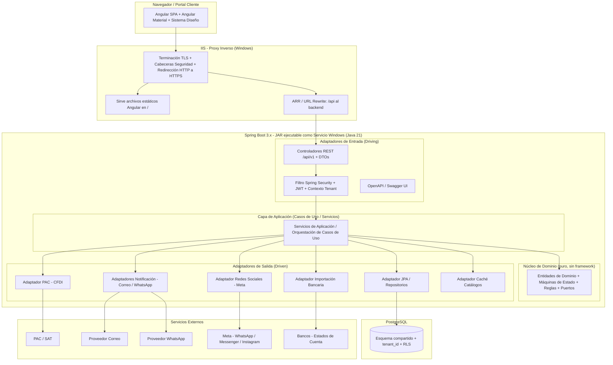

Los **webhooks entrantes** de Meta (mensajes de WhatsApp/Messenger/Instagram, resultados de publicación) se reciben en un **controlador REST dedicado** (adaptador de entrada) que llega a través del **Proxy Inverso (IIS)** sobre HTTPS con TLS válido conforme al Requisito 9; ese controlador valida la firma/autenticidad del evento antes de invocar el caso de uso correspondiente (Req 64.3).

**Regla de dependencia**: las flechas de dependencia apuntan siempre hacia el núcleo. El dominio define **puertos** (interfaces) que la infraestructura implementa mediante **adaptadores**. El dominio nunca importa clases de Spring, JPA, ni de proveedores externos.

### Organización en Monolito Modular

Se elige un **monolito modular** (no microservicios) por el contexto de despliegue on-premise en un único servidor Windows, priorizando simplicidad operativa, transacciones ACID locales y menor sobrecarga. Cada módulo tiene fronteras internas claras que permitirían extraerlo a un servicio independiente en el futuro.

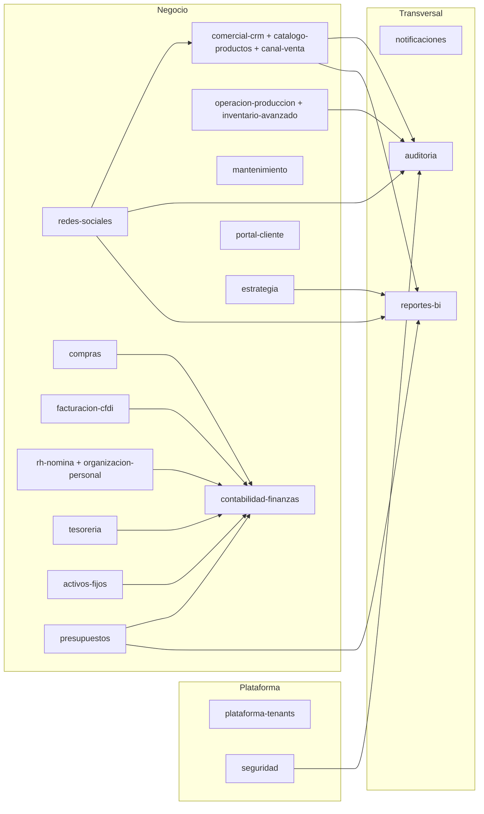

El módulo **`redes-sociales`** se define como un módulo de negocio propio, estrechamente acoplado a `comercial-crm` (del que consume Cliente, Contacto y Oportunidad para ligar las Conversacion y capturar leads) y a `notificaciones` (con el que comparte el envío por Canal_Social). Se mantiene como módulo separado —y no como submódulo de `comercial-crm`— por su cohesión propia (Bandeja_Unificada, publicación, campañas y analítica social) y por depender de un adaptador externo específico a las APIs de Meta; sus fronteras internas permiten extraerlo a un servicio independiente en el futuro.

**Módulos de negocio** (cada uno con sus paquetes `domain`, `application`, `adapter.in`, `adapter.out`):

| Módulo | Responsabilidad | Requisitos |
|---|---|---|
| `plataforma-tenants` | Empresas, Planes, Suscripciones, super_admin | 24, 25 |
| `seguridad` | Autenticación, JWT, autorización RBAC, usuarios, roles, permisos | 1–4, 27, 28 |
| `comercial-crm` | Clientes, Contactos, Oportunidades/pipeline, Cotizaciones, Pruebas de Diseño; **Catálogo de Productos y Listas de Precios** (Req 59) y **Canal_Venta** que clasifica Oportunidad y Cotizacion (Req 63) como submódulos del contexto comercial | 5, 6, 14, 15, 59, 63 |
| `operacion-produccion` | Órdenes de Fabricación, Levantamiento, Permisos, Inventario, Proyectos/Sitios; **inventario avanzado** (Almacenes, Kardex, Lotes, costeo promedio/PEPS, punto de reorden, transferencias, inventario perpetuo) que amplía el inventario base del Req 18 | 7, 16–19, 21, 60 |
| `redes-sociales` | Cuentas de Canal_Social, Bandeja_Unificada, Conversacion y Mensaje_Social, Plantilla_Mensaje, Opt_In/Opt_Out, Publicacion_Social, Campaña_Publicitaria y analítica social; integración con las APIs de Meta vía adaptador desacoplado; operado por el rol `marketing` (y consulta/atención por `ventas`) | 64, 65, 66 |
| `mantenimiento` | Contratos de Mantenimiento, Tickets de Servicio, SLA | 20 |
| `compras` | Proveedores, Requisiciones, Órdenes de Compra, Recepciones, Facturas de Proveedor, 3 vías | 29–33 |
| `facturacion-cfdi` | Facturas CFDI, timbrado/cancelación PAC, Complementos de Pago, Notas de Crédito | 34, 35, 37 |
| `contabilidad-finanzas` | Catálogo de cuentas, Pólizas, CxC, CxP, Estados Financieros | 36, 38, 39, 42, 47 |
| `rh-nomina` | Empleados, Contratos Laborales, Incidencias, Nómina, CFDI de nómina; **organización de personal** (Puesto, organigrama jerárquico sin ciclos, Evaluacion_Desempeno) que amplía la gestión de Empleado del Req 40 | 40, 41, 61 |
| `tesoreria` | Cuentas Bancarias, Estados de Cuenta, Conciliación Bancaria | 43 |
| `activos-fijos` | Activos Fijos y Depreciación | 44 |
| `portal-cliente` | Acceso restringido de Clientes | 45 |
| `estrategia` | Misión/visión/valores, Objetivos_Estrategicos con Resultados Clave ponderados e historial de avance | 58 |
| `presupuestos` | Presupuestos por área y periodo; variación real vs. presupuestado (solo lectura), en importe y porcentaje | 62 |
| `notificaciones` | Correo y WhatsApp vía puertos/adaptadores | 46 |
| `reportes-bi` | Tablero, reportes por área, Inteligencia de Negocio; segmentación por canal de venta, avance de objetivos/presupuestos y consolidación de métricas de redes sociales | 22, 48, 63, 66 |
| `auditoria` | Registro de auditoría inmutable encadenado, con valor anterior/nuevo, alertas, trace id y verificación de cadena | 10 |

### Estructura de Paquetes (backend)

```
com.empresa.crm
├── platform            # arranque, configuración transversal
│   ├── config          # Spring config, seguridad, OpenAPI, caché
│   ├── tenant          # TenantContext, filtro RLS, filtro Hibernate
│   ├── security        # JWT, RBAC, rate limiting, bloqueo
│   ├── audit           # Servicio_Auditoria encadenado
│   └── web             # manejo global de errores (RFC 7807), paginación
├── comercial
│   ├── domain          # Cliente, Cotizacion, Oportunidad... + puertos
│   ├── application     # casos de uso
│   └── adapter
│       ├── in.rest     # controladores + DTOs
│       └── out.persistence  # entidades JPA + repositorios
├── social              # Redes sociales / mensajería omnicanal (Req 64–66)
│   ├── domain          # Conversacion, Mensaje_Social, Plantilla_Mensaje, Publicacion_Social,
│   │                   #   Campaña_Publicitaria, Ventana_Servicio, Opt_In + MensajeriaSocialPort
│   ├── application     # casos de uso: bandeja unificada, envío, publicación, métricas
│   └── adapter
│       ├── in.rest     # controladores REST + DTOs + controlador de webhooks entrantes de Meta
│       └── out
│           ├── meta        # adaptadores Meta: WhatsApp Cloud API, Graph API, Marketing API
│           └── persistence # entidades JPA + repositorios
├── operacion
├── compras
├── facturacion
├── contabilidad
├── rhnomina
├── tesoreria
├── activosfijos
├── mantenimiento
├── portalcliente
├── estrategia         # Esencia_Empresa, Objetivo_Estrategico, Resultado_Clave (Req 58)
├── presupuestos       # Presupuesto y variación real vs. estimado (Req 62)
├── notificaciones
├── reportesbi
├── calidad             # Cumplimiento y calidad ISO 9001:2026 (Req 70): Queja_Cliente,
│                   #   No_Conformidad, Accion_Correctiva, Riesgo, Oportunidad_Calidad,
│                   #   Cambio_SGC, Contexto_Organizacion
└── plataforma
```

Los submódulos de **Catálogo de Productos/Listas de Precios** (Req 59) y **Canal_Venta** (Req 63) residen dentro de `comercial`; el **inventario avanzado** (Req 60) dentro de `operacion`; y la **organización de personal** (Req 61) dentro de `rhnomina`, respetando las fronteras internas del monolito modular y permitiendo su extracción futura. Las capacidades de **redes sociales y mensajería omnicanal** (Req 64–66) residen en el módulo `social`, con el adaptador a las APIs de Meta aislado en `social.adapter.out.meta`. Las capacidades de **cumplimiento y calidad ISO 9001:2026** (Req 70) residen en el módulo `calidad`, que reutiliza los servicios transversales de auditoría (evidencia documentada), tablero (indicadores de cultura de calidad) y redes sociales (percepción del cliente).

### Capas y Flujo de una Petición

1. **IIS (Proxy Inverso)**: termina TLS, aplica cabeceras de seguridad, redirige HTTP→HTTPS, enruta `/api` al backend (Req 9).
2. **Filtro de Seguridad (Spring Security)**: valida el JWT, extrae `tenant_id` y roles/permisos, establece el `TenantContext` y la variable de sesión de PostgreSQL `app.current_tenant` (Req 1, 23).
3. **Rate limiting / bloqueo**: aplica límites por IP y por cuenta (Req 2).
4. **Controlador REST**: recibe DTO validado (Bean Validation), lo mapea a comandos del caso de uso (Req 8, 12).
5. **Servicio de Aplicación**: orquesta el caso de uso, invoca el dominio, coordina puertos de salida dentro de una transacción.
6. **Dominio**: ejecuta reglas puras (máquinas de estado, cálculos monetarios, validaciones de invariantes).
7. **Adaptadores de salida**: persistencia JPA (con `tenant_id` y versión optimista), PAC, notificaciones, etc.
8. **Auditoría**: registra el evento en el log encadenado cuando aplica (Req 10).

---

## Components and Interfaces

### API REST — Convenciones Transversales (Req 12, 13)

- **Ruta base**: `/api/v1`.
- **DTOs**: todo recurso se expone/recibe mediante DTOs distintos de las entidades JPA. Mapeo con MapStruct.
- **Paginación**: parámetros `page` (0-index) y `size`; `size` por defecto **20**, máximo **100**. Un `size > 100` se rechaza con `400` (o se acota, según requisito específico; Req 7.8 exige rechazo). La respuesta incluye metadatos `page`, `size`, `totalElements`, `totalPages`.
- **Filtros**: cada listado admite los filtros indicados por su requisito (por estado, cliente, proveedor, fechas, etc.).
- **Errores**: respuestas tipo *Problem Details* (RFC 7807) sin filtrar detalles internos (Req 56.4, 8.2).
- **Versionado de recurso**: encabezado `If-Match`/campo `version` para concurrencia optimista (Req 49).
- **OpenAPI**: springdoc-openapi genera la especificación; Swagger UI navegable.

**Ejemplo de estructura de respuesta paginada:**

```json
{
  "content": [ { "...": "DTO" } ],
  "page": 0,
  "size": 20,
  "totalElements": 137,
  "totalPages": 7
}
```

**Ejemplo de Problem Details (error de validación, Req 8.2):**

```json
{
  "type": "https://crm/errors/validation",
  "title": "Datos inválidos",
  "status": 400,
  "detail": "Uno o más campos son inválidos",
  "errors": [ { "field": "rfc", "message": "Formato de RFC inválido" } ]
}
```

### Servicio de Autenticación (Req 1, 2, 11)

- **Puerto de entrada**: `POST /api/v1/auth/login`, `POST /api/v1/auth/refresh`, `POST /api/v1/auth/logout`.
- Verifica credenciales contra cuentas activas; hashing **BCrypt/Argon2** (Req 1.2).
- Emite **Token_Acceso** (JWT firmado, vigencia ≤ 15 min) y **Token_Refresco** (≤ 7 días). El JWT contiene `sub` (usuario), `tenant_id`, `roles`/`permisos` y `exp`.
- Errores de credenciales genéricos (no revelan qué credencial falló, Req 1.3).
- **Bloqueo**: 5 intentos fallidos consecutivos en ventana de 15 min → bloqueo 15 min; contador se reinicia al expirar el bloqueo (Req 2.1, 2.2).
- **Rate limiting**: > 100 peticiones/min por IP → `429` (Req 2.4). Implementado con un *bucket* por IP (Bucket4j o filtro propio).
- Los secretos (clave de firma JWT, credenciales de BD) provienen de variables de entorno/almacén externo; el arranque se detiene si falta un secreto (Req 11).

### Servicio de Autorización (Req 3, 27, 28)

- **RBAC con permisos atómicos**: cada permiso es una tupla `(recurso, operación)`, p. ej. `cliente:crear`, `cotizacion:cambiar_estado`, `factura:timbrar`.
- **Denegación por defecto**: si el permiso no está explícitamente concedido al rol, se deniega (`403`) (Req 3.5, 3.2).
- Aplicado con `@PreAuthorize` sobre métodos de servicio, evaluando permisos siempre **dentro del tenant** del usuario (Req 23.5).
- Roles predefinidos inmutables (Req 28.6) + **Rol_Personalizado** por empresa combinando permisos existentes (Req 28). Un rol personalizado no puede incluir permisos de nivel plataforma (Req 28.5).
- **Gating por Plan**: si un módulo no está habilitado en el Plan de la empresa, se deniega con `403` (Req 25.4).

### Contexto de Tenant y Multi-Tenancy (Req 23)

Ver sección dedicada *Multi-Tenancy* más abajo.

### Puertos de Integración Externa (portabilidad)

Definidos en el **dominio** como interfaces, implementados por **adaptadores** en infraestructura. Las credenciales se resuelven fuera del código (Req 11).

```java
// Núcleo de dominio (sin dependencias de framework)
public interface PacPort {
    ResultadoTimbrado timbrar(ComprobanteFiscal cfdi);
    ResultadoCancelacion cancelar(FolioFiscal uuid, MotivoCancelacion motivo);
}

public interface NotificacionPort {
    ResultadoEnvio enviar(Notificacion notificacion); // canal: CORREO | WHATSAPP
}

public interface ImportacionBancariaPort {
    List<MovimientoBancario> importar(EstadoCuentaFuente fuente);
}

public interface MensajeriaSocialPort { // Req 64, 65, 66
    ResultadoEnvio enviarMensaje(MensajeSocial mensaje);          // texto libre dentro de la Ventana_Servicio
    ResultadoEnvio enviarPlantilla(MensajeSocial mensaje, PlantillaMensaje plantilla); // fuera de la ventana
    ResultadoPublicacion publicarContenido(PublicacionSocial publicacion);            // Facebook / Instagram
    EstadoCampania consultarEstadoCampania(FolioCampania folio);  // Marketing API (solo lectura)
    MetricasCanal consultarMetricas(CanalSocial canal, Periodo periodo);              // agregación de solo lectura
}
```

El adaptador de `MensajeriaSocialPort` se compone por canal sobre las APIs oficiales de Meta: **WhatsApp Business Cloud API** (mensajería de WhatsApp), **Graph API** (Facebook Messenger e Instagram y publicación de contenido) y **Marketing API** (campañas). Las credenciales (token de usuario de sistema permanente para WhatsApp y token de acceso de página para Messenger/Instagram) se resuelven **fuera del código** conforme al Requisito 11 y nunca se escriben en logs. Los **eventos entrantes** (webhooks) no llegan por este puerto de salida sino por un **controlador REST dedicado** (adaptador de entrada) sobre HTTPS/TLS terminado en IIS (Req 9), que valida la firma del evento antes de persistir el Mensaje_Social entrante.

| Puerto | Adaptador(es) | Requisito | Secretos |
|---|---|---|---|
| `PacPort` | Adaptador HTTP al PAC (timbrado/cancelación CFDI 4.0, complementos, nómina) + stub para pruebas | 35, 36.4, 37, 41 | Credenciales PAC vía entorno/vault |
| `NotificacionPort` | Adaptador SMTP/API correo; adaptador API WhatsApp; con política de reintentos | 46 | API keys vía entorno/vault |
| `MensajeriaSocialPort` | Adaptadores Meta por canal: WhatsApp Business Cloud API, Graph API (Messenger/Instagram y publicación) y Marketing API (campañas), con política de reintentos + stub para pruebas | 64, 65, 66, 46.6 | Tokens de acceso Meta (usuario de sistema/página) vía entorno/vault |
| `ImportacionBancariaPort` | Adaptador de importación de estados de cuenta (archivo/API) | 43 | Credenciales por cuenta bancaria |

Al migrar a la nube, se sustituye el adaptador (p. ej. correo por SES, secretos por Secrets Manager) sin tocar el dominio.

### Servicio de Auditoría (Req 10)

- Puerto `AuditoriaPort` invocado por los casos de uso ante eventos de seguridad y de negocio (autenticación, gestión de acceso, cambios de estado, lecturas/exportaciones de datos sensibles).
- Cada `Registro_Auditoria` contiene: `actor`, `accion`, `recurso`, `tenant_id` (o marca de plataforma), `valor_anterior`/`valor_nuevo` (sin secretos), `trace_id`, marca temporal **UTC**, y un **hash encadenado** con el registro anterior (Req 10.2, 10.3, 10.7, 10.10, 10.12).
- **Inmutable**: sin update/delete a nivel de aplicación; reforzado con permisos de BD y RLS (Req 10.4).
- Consulta paginada y filtrable por actor, tipo de recurso y rango de fechas; exportable (Req 10.5, 10.9).
- **Alertas** configurables ante patrones sensibles y **verificación bajo demanda** de la cadena de hash con reporte de ruptura (Req 10.11, 10.13).
- Retención configurable (Req 10.8).

### Componentes Transversales

- **Validación**: Bean Validation (`jakarta.validation`) en DTOs + validaciones de dominio (Req 8).
- **Caché de catálogos**: Spring Cache (Caffeine) para catálogos de cambio lento (tipos de anuncio, unidades, estados, régimen fiscal) con invalidación por escritura (Req 12.3).
- **Manejo global de errores**: `@RestControllerAdvice` que produce Problem Details y traduce excepciones de dominio a códigos HTTP (400/403/404/409/429) sin fugas internas (Req 8, 56).
- **Health check**: Spring Boot Actuator `/actuator/health` (Req 51.4).
- **Procesamiento asíncrono**: operaciones intensivas (cálculo de nómina, estados financieros, BI, timbrado masivo) se ejecutan en un *executor* dedicado / colas internas para no bloquear la operación interactiva (Req 51.3).

### Servicios de los Módulos Nuevos (Req 58–63)

- **Estrategia (Req 58)**: gestiona `Esencia_Empresa` (misión/visión/valores) y `Objetivo_Estrategico` con `Resultado_Clave` ponderados. El caso de uso de actualización de avance persiste en `Historial_Avance` (sin sobrescribir) y recalcula el `avance` (0..100) y el `estado_derivado` como agregación de solo lectura. Listado paginado y filtrable por periodo y responsable.
- **Catálogo de Productos y Listas de Precios (Req 59)**: administra `Producto` (con borrado lógico e información comercial de apoyo) y `Lista_Precios`/`Precio_Producto` con vigencia y prioridad. Al agregar una Partida_Cotizacion referida a un Producto, el servicio **sugiere** el precio vigente (aplicando la lista de mayor prioridad o la del segmento del Cliente) sin imponerlo.
- **Inventario avanzado (Req 60)**: expone Almacenes, existencias por Almacén, Kardex (solo lectura), lotes y transferencias. El dominio implementa el **motor de costeo** (promedio ponderado y PEPS) y el cálculo del **punto de reorden**; emite notificaciones de stock mínimo/máximo y reabastecimiento (Req 46). Se integra con los movimientos del Req 18.
- **Organización de personal (Req 61)**: gestiona `Puesto` con jerarquía validada como **grafo acíclico**, `Asignacion_Puesto` y `Evaluacion_Desempeno` con escala e historial. Consulta del organigrama derivada de la jerarquía de Puestos.
- **Presupuestos (Req 62)**: registra `Presupuesto` por área y periodo y calcula la **variación** (importe y porcentaje, favorable/desfavorable) contra el real derivado de las operaciones, destacando desviaciones por encima del umbral.
- **Canal de venta (Req 63)**: catálogo `Canal_Venta` y asignación opcional en Oportunidad/Cotizacion; habilita la segmentación en reportes comerciales y de BI (Req 14, 22, 48).

Todas estas operaciones respetan el aislamiento por `tenant_id`, la autorización RBAC deny-by-default, la paginación estándar y el registro de auditoría del Req 10.

### Servicios de Redes Sociales y Mensajería Omnicanal (Req 64–66)

Estos servicios residen en el módulo `social` y se apoyan en el `MensajeriaSocialPort` para toda comunicación con Meta. Respetan el aislamiento por `tenant_id`, la autorización RBAC deny-by-default (operados por el rol `marketing` y, para atención comercial, por `ventas`), la paginación estándar y la auditoría del Req 10.

- **Configuración de Cuenta_Canal_Social (Req 64.1, 64.2)**: registra la conexión de la Empresa a un Canal_Social (número de WhatsApp Business, página de Facebook o perfil de Instagram) vinculada al `tenant_id`. Las credenciales se obtienen conforme al Req 11 (referencia externa, nunca el valor en la entidad). La integración con las APIs de Meta se realiza a través del adaptador desacoplado que preserva la portabilidad del núcleo.

- **Recepción de eventos entrantes (webhooks) (Req 64.3, 64.4)**: un controlador REST dedicado recibe los eventos de Meta sobre HTTPS/TLS (Req 9), valida la autenticidad/firma del evento y persiste el Mensaje_Social entrante asociándolo a su Conversacion. El servicio **asocia** el remitente a un Cliente o Contacto existente cuando el identificador coincide y, cuando no existe coincidencia, **crea** un Contacto o una Oportunidad a partir del remitente (integración con el pipeline del Req 14).

- **Bandeja_Unificada (Req 64.5)**: vista consolidada que reúne las Conversacion de los tres Canal_Social en un **único hilo por Cliente o Contacto**, con historial y contexto compartidos, siempre dentro del `tenant_id` de la Empresa. Permite filtrar por Canal_Social, por Cliente y por estado de la Conversacion (Req 64.14).

- **Control de Ventana_Servicio y envío (Req 64.6, 64.7)**: el dominio evalúa la **Ventana_Servicio de 24 horas** contada desde el último Mensaje_Social entrante. Dentro de la ventana se permite texto libre; **fuera de la ventana** el envío de texto libre se rechaza y se exige una Plantilla_Mensaje aprobada o un mensaje etiquetado. Se soportan **mensajes interactivos** (botones o listas) donde el canal lo admita (Req 64.11).

- **Consentimiento (Opt_In/Opt_Out) (Req 64.8, 64.9)**: el envío de Mensaje_Social de **marketing** requiere un Opt_In vigente para el Canal_Social; en su ausencia el envío se rechaza. El otorgamiento o revocación del consentimiento se registra con el Canal_Social, el actor y la marca temporal UTC.

- **Asignación y handover de Conversacion (Req 64.10)**: un Usuario con Permiso puede asignar o transferir una Conversacion a otro Usuario o agente; el sistema registra la asignación y conserva el historial.

- **Captura de leads (Req 64.12)**: cuando un prospecto llega por un anuncio o por click-to-WhatsApp, el servicio crea o vincula una Oportunidad (Req 14) a partir de esa Conversacion.

- **Reintentos (Req 64.13)**: si el envío de un Mensaje_Social falla, se reintenta conforme a una política de reintentos configurable, registrando el resultado de cada intento (patrón análogo al de notificaciones del Req 46).

- **Publicación de contenido (Req 65)**: gestiona `Publicacion_Social` para Facebook e Instagram con su máquina de estados (`borrador → programada → {publicada | fallida}`). Al llegar la fecha programada, un proceso publica el contenido a través del adaptador de Meta y actualiza el estado a `publicada` o `fallida`, con reintentos configurables ante fallo.

- **Campañas publicitarias (Req 65.7–65.9)**: gestiona `Campaña_Publicitaria` (presupuesto en MXN y periodo con fechas válidas) y **consulta** su estado desde la Marketing API de Meta como información de **solo lectura**.

- **Analítica social (Req 66)**: calcula métricas por Canal_Social y periodo (alcance, interacciones, Mensaje_Social recibidos y enviados, tiempo de respuesta, y conversiones/leads) como **agregaciones de solo lectura** que no modifican los datos de origen. Permite segmentar por canal de venta (Req 63), consolidar en el Tablero y la Inteligencia_Negocio (Req 22, 48) y exportar los resultados; el acceso sin permiso analítico/comercial se deniega con 403 (Req 66.5) y las métricas solo incluyen datos de la Empresa del Usuario (Req 66.6).


### Servicios de Cumplimiento y Calidad ISO 9001:2026 (Req 70)

Estos servicios residen en el módulo `calidad` (paquete `com.empresa.crm.calidad`) y aportan las capacidades que habilitan y evidencian el Sistema de Gestión de Calidad de la Empresa conforme a ISO 9001:2026. Como todo módulo de negocio, respetan el aislamiento por `tenant_id` (Req 23), la autorización RBAC deny-by-default (Req 3), la paginación estándar (Req 12) y el registro de auditoría inmutable (Req 10). El módulo NO introduce lógica fiscal ni financiera; se apoya en los servicios existentes (auditoría, notificaciones, tablero, redes sociales) y añade los conceptos propios de calidad.

- **Gestión de Queja_Cliente (Req 70.1, cláusula 10.2)**: registra reclamaciones del Cliente con su origen (incluido el canal de la Bandeja_Unificada del Req 64), descripción, Cliente asociado y marca temporal UTC. Permite **vincular** —sin obligar— una Queja_Cliente como entrada a una Accion_Correctiva. La creación desde una Conversacion social reutiliza el vínculo Cliente/Contacto ya resuelto por el módulo `social`.

- **Gestión de No_Conformidad y Accion_Correctiva (Req 70.2, cláusula 10.2)**: administra No_Conformidad y su Accion_Correctiva asociada (responsable, causa raíz, acciones planificadas, evidencia de cierre y verificación de eficacia). La Accion_Correctiva sigue una **máquina de estados pura** (`abierta → en_analisis → en_ejecucion → verificacion → cerrada`), reutilizando el componente `MaquinaEstados<E>` común; `cerrada` es estado final. El cierre exige registrar la eficacia verificada.

- **Registros separados de Riesgo y Oportunidad (Req 70.3, cláusulas 6.1.2 y 6.1.3)**: dos agregados distintos —`Riesgo` y `Oportunidad`— cada uno con descripción, evaluación y acciones propias, de modo que las acciones para abordar riesgos y las acciones para aprovechar oportunidades se determinen y consulten por separado, reflejando la separación que introduce ISO 9001:2026.

- **Gestión del cambio del SGC (Req 70.4, cláusula 6.3)**: registra un Cambio_SGC exigiendo propósito, consecuencias potenciales, recursos necesarios y responsable antes de aprobarlo. La aprobación queda en auditoría con actor y marca temporal UTC. El Cambio_SGC sigue una máquina de estados simple (`propuesto → aprobado → implementado`, con `rechazado` como final alterno).

- **Contexto_Organizacion y cambio climático (Req 70.5, cláusulas 4.1 y 4.2)**: permite determinar y documentar las cuestiones internas/externas pertinentes al SGC —incluida explícitamente la pertinencia del cambio climático— y las expectativas de las partes interesadas, conservando la justificación aun cuando la conclusión sea "no pertinente".

- **Evidencia documentada (Req 70.6, cláusula 7.5)**: no añade almacenamiento nuevo; **reutiliza** el Servicio_Auditoria (Req 10) como "información documentada disponible como evidencia". Cada operación sobre recursos de calidad genera un Registro_Auditoria encadenado con integridad y no repudio.

- **Indicadores de cultura de calidad en el Tablero (Req 70.7, cláusulas 5.1.1 y 7.3)**: expone, como **agregaciones de solo lectura** (Req 22), indicadores derivados de los datos del propio Sistema: No_Conformidad abiertas/cerradas, tiempo medio de cierre de Accion_Correctiva, tasa de reincidencia de una misma No_Conformidad y quejas atendidas en tiempo. Estos indicadores sustentan la responsabilidad de la alta dirección sobre la cultura de calidad.

- **Redes sociales como percepción del cliente (Req 70.8, nota a la cláusula 9.1.2)**: integra las métricas sociales del Req 66 como una fuente más de percepción/satisfacción del Cliente, consultable junto a los indicadores de calidad.

- **Trazabilidad de cláusulas (Req 70.10)**: el módulo publica una vista de solo lectura que mapea cada cláusula soportada de ISO 9001:2026 al recurso o evidencia del Sistema que la habilita (ver la tabla de trazabilidad en la sección de Data Models). Toda creación o cambio de estado de recursos de calidad se audita (Req 70.9).
---

## External Services and Cost Considerations

El Sistema se integra con varios servicios externos de terceros a través de **puertos/adaptadores desacoplados**. Algunas de esas integraciones conllevan un **costo operativo** (de terceros), otras no tienen cargo directo por su API pero exigen requisitos de habilitación, y otras dependen del proveedor de infraestructura que elija la Empresa. Esta sección documenta esas consideraciones para dimensionar el costo total de operación y guiar decisiones de diseño que lo optimicen.

> **Aviso**: las tarifas y modelos de cobro descritos aquí son **orientativos y de referencia**; pueden variar según el proveedor, el país del destinatario, el volumen contratado y la fecha. No constituyen una cotización. La Empresa debe validar los precios vigentes con cada proveedor. El Sistema **no** agrega cuotas propias de licenciamiento por estas APIs: los costos son de terceros y de naturaleza operativa.

### Resumen de servicios y modelo de costo

| Servicio externo | Puerto/Adaptador | Requisitos | Modelo de costo | ¿Tiene costo de uso? |
|---|---|---|---|---|
| PAC / Timbrado CFDI (facturas, notas de crédito, complementos de pago, recibos de nómina) | `PacPort` | 35, 36.4, 37, 41 | Por timbre (por comprobante emitido); paquetes de folios o planes | **Sí** (obligatorio para validez fiscal) |
| WhatsApp Business Cloud API | `MensajeriaSocialPort` | 64, 65, 46 | Por mensaje de plantilla entregado (per‑message); respuestas en ventana de 24 h gratuitas | **Sí** (según categoría y país) |
| Meta Ads / Campañas (Marketing API) | `MensajeriaSocialPort` | 65 | La API es gratuita; el costo es el **gasto publicitario** (presupuesto) por subasta (CPM/CPC) | **Sí**, pero el gasto lo define y controla la Empresa |
| Graph API de Facebook Messenger e Instagram (mensajería y publicación) | `MensajeriaSocialPort` | 64, 65 | Sin cargo por llamada; requiere habilitación y está sujeta a límites de tasa | **No** (sin costo monetario directo) |
| Correo electrónico (SMTP/API) | `NotificacionPort` | 46 | Depende del proveedor (plan gratuito o de pago según volumen) | **Depende del proveedor** |
| Importación bancaria | `ImportacionBancariaPort` | 43 | Por archivo (sin costo) o por API del banco (según banco) | **Depende del banco** |
| Certificado TLS y dominio | Proxy_Inverso (IIS) | Restricciones, 9 | Certificado gratuito (p. ej. ACME/Let's Encrypt) o de pago; dominio de pago | **Depende de la opción elegida** |

### Servicios con costo de uso

- **PAC / Timbrado CFDI (Req 35, 36.4, 37, 41)**: el Timbrado de un CFDI ante un PAC autorizado tiene **costo por timbre**, es decir, por cada comprobante emitido: Factura (CFDI), Nota_Credito, Complemento_Pago y Recibo_Nomina. En México el cobro suele estructurarse por **paquetes de folios/timbres** o por planes (incluidos los de folios ilimitados), con un costo por timbre a volumen del orden de **pocos pesos MXN** (referencia orientativa ~$0.30–$1.50 MXN por timbre según volumen, o planes de folios/ilimitados). Es un **costo operativo obligatorio** para dar validez fiscal a los comprobantes. El Sistema permite configurar el PAC y resolver sus credenciales conforme a la gestión de secretos (Req 11) y **lleva control del consumo de timbres** por Empresa (ver *Medición y control de consumo* más abajo).

- **WhatsApp Business Cloud API (Req 64, 65, 46)**: desde 2025 Meta cobra **por mensaje de plantilla entregado** (modelo *per‑message*) y **no** aplica una cuota de suscripción por el uso de la API. Las **respuestas de servicio dentro de la Ventana_Servicio de 24 horas son gratuitas**; los mensajes de **plantilla** (utilidad, autenticación y marketing) tienen una tarifa que varía por **categoría** y por **país del destinatario**. *Recomendación de diseño*: favorecer las respuestas dentro de la ventana de 24 h y las plantillas de **utilidad** para optimizar el costo, y **medir el volumen de mensajes por categoría** (se integra con la analítica del Req 66) para dar visibilidad del gasto.

- **Meta Ads / Campañas (Marketing API) (Req 65)**: la **Marketing API en sí es gratuita**; el costo relevante es el **gasto publicitario** (presupuesto) que la Empresa define para sus Campaña_Publicitaria, cobrado por el modelo de **subasta (CPM/CPC)**. El Sistema únicamente **gestiona y consulta** la campaña (estado de solo lectura); el gasto lo controla la Empresa mediante el **presupuesto**, que ya se modela en `Campaña_Publicitaria` en MXN (rango 0.01..999,999,999.99).

### Servicios sin costo de API (con requisitos de habilitación)

- **Graph API de Facebook Messenger e Instagram (Req 64, 65)**: la mensajería entrante/saliente y la publicación de contenido a través de la Graph API **no** tienen un cargo monetario directo por llamada. Sin embargo, requieren **cuenta Business/Creator**, **verificación del negocio en Meta** y **revisión de la app (App Review)** —un costo de **tiempo y proceso**, no monetario— y están sujetas a **límites de tasa (rate limits)**. Los **webhooks entrantes** no tienen costo, pero exigen **HTTPS con un certificado TLS válido** terminado en el Proxy_Inverso (Req 9).

### Costos de infraestructura / según proveedor

Estos costos **no** son cuotas de API del CRM; dependen de las opciones que elija la Empresa:

- **Correo electrónico (Req 46)**: el envío por SMTP o API de correo depende del **proveedor elegido**, que puede ofrecer un plan gratuito o de pago según el volumen.
- **WhatsApp para Notificaciones (Req 46)**: cuando las Notificaciones se envían por WhatsApp, aplica el mismo **costo por mensaje de plantilla** de Meta descrito arriba (reutiliza la integración del Req 64).
- **Importación bancaria (Req 43)**: puede realizarse **por archivo** (sin costo) o **por API del banco** (según las condiciones de cada banco).
- **Certificado TLS y dominio (Restricciones, Req 9)**: la Empresa asume el costo del **dominio** y del **certificado TLS** para IIS y para la recepción de webhooks; existen certificados **gratuitos** (p. ej. ACME/Let's Encrypt) y de pago.

### Medición y control de consumo

Para dar visibilidad del gasto operativo y evitar sorpresas, el Sistema instrumenta el consumo de las integraciones con costo, apoyándose en los adaptadores y en la auditoría (Req 10):

- **Consumo de timbres del PAC**: cada Timbrado exitoso (Factura, Nota_Credito, Complemento_Pago, Recibo_Nomina) queda registrado por Empresa (`tenant_id`) con su marca temporal, lo que permite contabilizar los timbres consumidos por periodo y contrastarlos con el paquete/plan contratado.
- **Volumen de mensajes de WhatsApp por categoría**: el adaptador de WhatsApp registra, por Mensaje_Social saliente, si se envió como respuesta dentro de la Ventana_Servicio (gratuita) o como Plantilla_Mensaje y su categoría, alimentando la analítica de redes sociales (Req 66) para estimar el costo por periodo.
- Estas mediciones son **agregaciones de solo lectura** que no alteran los datos de origen y respetan el aislamiento por `tenant_id`.

### Nota de arquitectura (portabilidad y optimización de costos)

Todas estas integraciones están **detrás de puertos/adaptadores desacoplados** (`PacPort`, `MensajeriaSocialPort`, `NotificacionPort`, `ImportacionBancariaPort`). Gracias a ello, la Empresa puede **cambiar de proveedor** —de PAC, de *Business Solution Provider* (BSP) de WhatsApp, de proveedor de correo o de fuente de importación bancaria— **sin reescribir el núcleo de negocio**, sustituyendo únicamente el adaptador correspondiente. Esto permite renegociar tarifas o migrar a un proveedor más económico preservando la portabilidad del Sistema. Como se indicó, el Sistema **no** introduce cuotas propias de licenciamiento por estas APIs; los costos son **de terceros y operativos**.

---

## Multi-Tenancy

El aislamiento multi-empresa (Req 23) se implementa con **defensa en profundidad** de dos capas sobre un **esquema compartido con discriminador**.

### Capa 1 — Discriminador `tenant_id` en la aplicación

- Todas las tablas de negocio incluyen la columna `tenant_id`.
- El `tenant_id` se **deriva del JWT** y nunca se acepta como parámetro de la petición (Req 23.4).
- Un **filtro de servlet** extrae el `tenant_id` del token autenticado y lo coloca en un `TenantContext` (ThreadLocal / RequestScope).
- Un **filtro global de Hibernate** (`@FilterDef`/`@Filter tenantFilter`) se habilita por petición y añade automáticamente `WHERE tenant_id = :tenant` a todas las consultas de entidades multi-tenant.
- Las escrituras asignan el `tenant_id` del contexto automáticamente (interceptor de persistencia), evitando que el código de negocio lo manipule.

```java
public final class TenantContext {
    private static final ThreadLocal<UUID> CURRENT = new ThreadLocal<>();
    public static void set(UUID tenantId) { CURRENT.set(tenantId); }
    public static UUID require() { /* lanza si no hay tenant */ }
    public static void clear() { CURRENT.remove(); }
}
```

### Capa 2 — Row-Level Security (RLS) en PostgreSQL

- Cada tabla de negocio activa RLS con una política que compara `tenant_id` con la variable de sesión `app.current_tenant`.
- Antes de ejecutar consultas de una petición, el sistema fija la variable en la conexión:

```sql
-- Política aplicada por tabla de negocio
ALTER TABLE cliente ENABLE ROW LEVEL SECURITY;
CREATE POLICY tenant_isolation ON cliente
  USING (tenant_id = current_setting('app.current_tenant')::uuid);

-- Al inicio de cada petición (mismo pool/conexión que la transacción):
SET LOCAL app.current_tenant = '<tenant-del-jwt>';
```

- La variable se establece por transacción (`SET LOCAL`) desde un interceptor que se ejecuta tras resolver el `TenantContext`, garantizando que aunque una consulta olvidara el filtro de aplicación, **la base de datos igual impide el acceso cruzado**.
- El usuario de BD de la aplicación **no** es superusuario ni `BYPASSRLS`, de modo que las políticas siempre aplican.

### Comportamiento ante acceso cruzado y unicidad

- Un intento de acceder/modificar un recurso de otro tenant devuelve **404** (no revela existencia) y se registra en auditoría (Req 23.3).
- Las restricciones de unicidad de negocio son **por tenant**, no globales: p. ej. `UNIQUE (tenant_id, rfc)` para clientes/proveedores activos (Req 23.6).
- El **Super_Administrador** opera a nivel plataforma y **no** accede a datos de negocio de las empresas; sus operaciones usan un contexto de plataforma sin `tenant_id` de negocio (Req 24.3, 10.3).

---

## Security

### Autenticación (Req 1, 2)

- **JWT firmado** (HMAC/clave asimétrica) con `tenant_id`, `roles`, `permisos`, `exp`. Token_Acceso ≤ 15 min; Token_Refresco ≤ 7 días con rotación y revocación (lista de refresco revocados).
- Contraseñas con **BCrypt** (o Argon2) y sal por usuario.
- **Bloqueo de cuenta** (5 fallos/15 min) y **rate limiting** (100 req/min/IP → 429).
- Errores de autenticación genéricos.

### Autorización (Req 3, 27, 28)

- **RBAC deny-by-default** con permisos atómicos, evaluado dentro del tenant.
- Roles predefinidos + roles personalizados por empresa; sin permisos de plataforma en roles de empresa.

### Protección de comunicación y navegador (Req 9)

- **TLS terminado en IIS**; redirección HTTP→HTTPS; rechazo de conexiones no cifradas.
- Cabeceras: `Content-Security-Policy`, `Strict-Transport-Security`, `X-Frame-Options` (configuradas en IIS y/o Spring Security).
- **Protección CSRF** para operaciones de cambio de estado originadas en navegador (patrón token CSRF para sesiones basadas en cookie; para API con Bearer token, política CSRF acorde al esquema elegido).

### Validación y anti-inyección (Req 8)

- Bean Validation en toda entrada; consultas **parametrizadas** (JPA/consultas con parámetros) para evitar inyección SQL; codificación de salida para evitar XSS.

### Gestión de secretos (Req 11)

- Secretos desde variables de entorno o almacén externo; arranque abortado si falta un secreto (registrando el **nombre**, nunca el valor); los valores de secretos nunca se escriben en logs de aplicación ni de auditoría.

### Integración con redes sociales — webhooks, credenciales y cumplimiento (Req 9, 11, 64–66)

- **Webhooks entrantes de Meta**: se reciben exclusivamente sobre **HTTPS con TLS válido** terminado en IIS conforme al Requisito 9. El controlador REST dedicado **valida la firma/autenticidad** del evento (verificación de la firma de la petición del webhook) antes de procesarlo, descartando eventos no auténticos.
- **Credenciales/tokens de Meta**: los tokens de acceso (token de usuario de sistema permanente para WhatsApp y token de acceso de página para Messenger/Instagram) y demás credenciales de la Cuenta_Canal_Social se gestionan conforme al Requisito 11 (variables de entorno/almacén externo referenciadas por `credenciales_ref`), **nunca** embebidos en el código ni escritos en logs de aplicación o de auditoría.
- **Cumplimiento de mensajería**: el sistema respeta las reglas de cada canal: **Opt_In** previo del destinatario para mensajería de marketing (Req 64.8, 46.7), respeto de la **Ventana_Servicio** de 24 horas para texto libre y uso de **Plantilla_Mensaje aprobadas** fuera de dicha ventana (Req 64.6, 64.7).
- **Multi-tenant y auditoría**: toda Cuenta_Canal_Social, Conversacion, Mensaje_Social, Publicacion_Social y Campaña_Publicitaria queda aislada por `tenant_id` (Req 23) y sus eventos (envío/recepción de mensajes, cambios de estado de Conversacion, publicaciones y campañas) se registran en el log de auditoría con el actor o evento origen, la acción, el Canal_Social, el recurso, el `tenant_id` y la marca temporal UTC (Req 64.15, 65.11).

### Auditoría inmutable y no repudio (Req 10)

- Log encadenado por hash; consulta/exportación de datos sensibles también auditada (Req 10.6); retención configurable.
- **Valor anterior/nuevo** (Req 10.10): para cada evento de modificación, el `Registro_Auditoria` conserva el valor previo y el valor nuevo de los campos relevantes en campos `valor_anterior`/`valor_nuevo`, **excluyendo secretos** (contraseñas, claves, credenciales) que nunca se registran.
- **Alertas configurables** (Req 10.11): un Administrador con Permiso define reglas `Alerta_Auditoria` para patrones sensibles (múltiples accesos denegados, exportaciones masivas de datos sensibles, intentos de acceso a otra Empresa). Al detectarse un patrón dentro de su ventana, el sistema emite una Notificacion (Req 46) al destinatario configurado.
- **Trazabilidad extremo a extremo** (Req 10.12): cada `Registro_Auditoria` incluye el `trace_id` (identificador de correlación) de la petición, propagado desde el filtro de entrada, para correlacionar la cadena completa de eventos de una operación.
- **Verificación de la cadena** (Req 10.13): la API ofrece una operación (bajo Permiso) para verificar la integridad de la cadena de hash de un rango de registros y **reportar la posición de cualquier ruptura** detectada, sustentando el no repudio.

### Respaldo y recuperación (Req 50)

- Respaldos periódicos cifrados de datos de negocio, fiscales y contables, con RPO/RTO configurables; restauración auditada; acceso restringido a respaldos.

### Cifrado de datos sensibles en reposo (Req 67)

Los datos sensibles se protegen **en reposo** con una estrategia de defensa en profundidad complementaria al cifrado en tránsito (TLS, Req 9) y al cifrado de respaldos (Req 50), **sin reemplazar** a ninguno de ellos.

- **Cifrado a nivel de almacenamiento/BD**: se aplica cifrado del volumen o *tablespace* de PostgreSQL (cifrado transparente a nivel de disco/almacenamiento) para proteger todos los datos persistidos. Para los campos **altamente sensibles** (datos fiscales, financieros y personales de Cliente, Empleado y Proveedor, así como Factura (CFDI) y Recibo_Nomina) se puede reforzar con **cifrado a nivel de columna** en la capa de aplicación (convertidor de atributos JPA con la Llave_Cifrado resuelta por Req 11).
- **Gestión de la Llave_Cifrado (Req 67.2, 67.3)**: el material criptográfico se obtiene desde variables de entorno o un almacén de configuración externo conforme al Req 11 y **nunca** se persiste en claro ni se escribe en logs de aplicación o de auditoría. El sistema soporta **rotación** de la Llave_Cifrado: al rotar, se conserva la capacidad de **descifrar los datos previamente cifrados** (versionado de la llave por `alias`/versión; los datos referencian la versión con la que fueron cifrados).
- **Credenciales/tokens de integraciones (Req 67.4)**: las credenciales de integraciones externas —PAC, Canal_Social (`credenciales_ref` de Cuenta_Canal_Social), proveedores de correo y bancos— se conservan **cifradas en reposo** y nunca en texto claro.
- **Indisponibilidad de la llave (Req 67.6)**: si una Llave_Cifrado requerida no está disponible, el sistema **impide el acceso** a los datos cifrados afectados (o detiene el arranque cuando la llave es esencial, en línea con Req 11.2) y registra el evento **sin exponer el valor** de la llave.
- **Auditoría (Req 67.7)**: toda operación de gestión de Llave_Cifrado (alta, rotación, revocación) se registra en el log de auditoría (Req 10) con el actor, la acción, el recurso afectado y la marca temporal UTC, **sin incluir el valor** de la llave.

### Gestión y revocación de sesiones (Req 68)

El manejo de Sesion se sustenta en el Token_Acceso de vida corta (≤ 15 min, Req 1.4) y el Token_Refresco de vida más larga (≤ 7 días, Req 1.7), reforzado con un mecanismo de revocación.

- **Almacén de refresh tokens y denylist**: cada Token_Refresco emitido se registra (con su `jti`, usuario, `tenant_id`, emisión y expiración). La revocación se implementa mediante un **registro de refresco revocados** (denylist por `jti`) o su equivalente; todo Token_Refresco revocado se **rechaza** conforme al Req 1.9.
- **Revocación en logout (Req 68.1)**: al cerrar sesión, el Token_Refresco del Usuario se revoca de modo que no pueda emitir nuevos Token_Acceso.
- **Revocación por administrador y por desactivación (Req 68.2)**: un Administrador con Permiso puede revocar las Sesion de una cuenta; cuando la cuenta se desactiva (Req 4.2), los Token_Refresco vigentes se invalidan y, tras la expiración del Token_Acceso vigente, se impide todo acceso de esa cuenta. Al ser el Token_Acceso de **vida corta**, la ventana residual tras revocar el refresco queda acotada a ≤ 15 min.
- **Revocación por evento de seguridad (Req 68.4)**: ante un cambio de contraseña u otro evento relevante, los Token_Refresco emitidos previamente a esa cuenta se revocan.
- **Consulta de sesiones activas (Req 68.5)**: la API expone el listado paginado (por defecto 20, máximo 100) de Sesion/Token_Refresco vigentes de una cuenta.
- **Auditoría (Req 68.6)**: el cierre o revocación de una Sesion se registra en auditoría con el actor, la cuenta afectada, la acción y la marca temporal UTC. El bloqueo por intentos fallidos y el rate limiting se cubren en el Req 2 (no se duplican aquí).

### Portabilidad y baja del tenant (offboarding) (Req 69)

El proceso de Offboarding_Empresa cubre la portabilidad y la baja de datos de una Empresa respetando el aislamiento por `tenant_id` (Req 23) y la retención fiscal.

- **Exportación por tenant (Req 69.1)**: a solicitud del Super_Administrador con Permiso o de la Empresa (vía su Administrador_Empresa), el sistema genera una exportación de los datos de negocio **estrictamente limitada al `tenant_id`** de la Empresa, en un **formato estructurado y procesable** (por ejemplo, JSON y/o CSV).
- **Periodo_Gracia (Req 69.2)**: al cancelar la Suscripcion (coherente con Req 24 y 25), el sistema **conserva** los datos de la Empresa durante un `Periodo_Gracia` **configurable** antes de cualquier eliminación, manteniendo el acceso restringido según el estado de la Empresa (Req 24).
- **Eliminación/anonimización acotada (Req 69.3, 69.5)**: tras el Periodo_Gracia, el Super_Administrador con Permiso ejecuta la eliminación o anonimización de los datos de negocio identificados por su `tenant_id`, **sin afectar** los datos de otras Empresas; el proceso se apoya en el aislamiento por `tenant_id` y en RLS de PostgreSQL.
- **Preservación fiscal (Req 69.4)**: los comprobantes fiscales bajo retención (Factura (CFDI), Recibo_Nomina y Poliza_Contable) se **preservan** conforme al periodo de retención aplicable —o se documenta su archivado seguro— aun cuando se eliminen otros datos.
- **Auditoría (Req 69.6)**: cada exportación o eliminación de datos de una Empresa se registra en auditoría con el actor, la Empresa afectada, la acción, el alcance y la marca temporal UTC.

---

## Data Models

### Convenciones del modelo

- **Identificadores**: `UUID` como clave primaria de negocio.
- **Multi-tenant**: toda tabla de negocio incluye `tenant_id UUID NOT NULL` con RLS activa e índice por `tenant_id`.
- **Dinero**: tipo `NUMERIC(18,2)` (nunca `float`/`double`); redondeo *half-up* a 2 decimales (Req 6.3–6.5, 31.3–31.5, 34.2).
- **Concurrencia optimista**: columna `version BIGINT` (`@Version`) en toda entidad de negocio **modificable** (Req 49). Una escritura sobre versión obsoleta → `409`.
- **Auditoría temporal**: `created_at`, `updated_at`, `created_by`, `updated_by` en UTC.
- **Borrado lógico**: entidades como Cliente, Proveedor, Empleado usan bandera `activo` para preservar histórico (Req 5.9, 29.5, 40.4).
- **Inmutabilidad**: CFDI timbrados, recibos de nómina, pólizas y registros de auditoría no se modifican ni eliminan (solo reverso/corrección o histórico).

### Entidades principales por módulo

**Plataforma y Seguridad**

- `Empresa` (tenant): `id (tenant_id)`, `nombre`, `rfc`, `estado (activa|suspendida|cancelada)`, `branding_nombre_visible`, `branding_logo`, `fecha_cancelacion (null)`, `fin_periodo_gracia (null)`, `version`. Los campos `fecha_cancelacion` y `fin_periodo_gracia` sustentan el offboarding del tenant (Req 69).
- `Plan`: `id`, `nombre`, `max_usuarios`, `modulos_habilitados (jsonb)`.
- `Suscripcion`: `id`, `tenant_id`, `plan_id`, `estado`, `vigencia_inicio`, `vigencia_fin`.
- `Usuario`: `id`, `tenant_id (null para super_admin)`, `identificador_acceso`, `hash_password`, `activo`, `intentos_fallidos`, `bloqueado_hasta`, `version`.
- `Rol`: `id`, `tenant_id (null si predefinido de sistema)`, `nombre`, `predefinido (bool)`.
- `Permiso`: `id`, `recurso`, `operacion` (atómico).
- `Rol_Permiso` (N:M), `Usuario_Rol` (N:M).
- `Token_Refresco` (Sesion): `id`, `tenant_id (null para super_admin)`, `usuario_id`, `jti`, `emitido_utc`, `expira_utc`, `revocado (bool)`, `revocado_utc (null)`, `motivo_revocacion (null: logout|admin|desactivacion|cambio_password)`. Sustenta la denylist/registro de refresco revocados para la revocación de Sesion (Req 68); un refresco con `revocado = true` se rechaza conforme al Req 1.9.
- `Llave_Cifrado` (**solo metadatos, nunca el valor**): `id`, `alias`, `estado (activa|rotada|revocada)`, `fecha_activacion`, `fecha_rotacion (null)`. El material criptográfico se resuelve por Req 11 desde un almacén externo y **no se persiste en claro** (Req 67); el versionado por `alias`/estado habilita la rotación conservando la capacidad de descifrar datos previos.

Las credenciales de integraciones externas —`credenciales_ref` de `Cuenta_Canal_Social` y las credenciales de PAC, proveedores de correo y bancos— se conservan **cifradas en reposo** y nunca en texto claro (Req 67.4).

**Comercial / CRM**

- `Cliente`: `id`, `tenant_id`, `nombre`, `rfc`, `email`, `telefono`, `activo`, `version`. `UNIQUE (tenant_id, rfc)` para activos.
- `Contacto`: `id`, `tenant_id`, `cliente_id`, `nombre`, `email`, `telefono`.
- `Oportunidad`: `id`, `tenant_id`, `cliente_id`, `titulo`, `valor_estimado NUMERIC(18,2)`, `etapa`, `responsable_id`, `version`.
- `Cotizacion`: `id`, `tenant_id`, `cliente_id`, `oportunidad_id (null)`, `estado`, `total NUMERIC(18,2)`, `version`.
- `Partida_Cotizacion`: `id`, `tenant_id`, `cotizacion_id`, `descripcion`, `cantidad`, `precio_unitario NUMERIC(18,2)`, `subtotal NUMERIC(18,2)`.
- `Prueba_Diseno`: `id`, `tenant_id`, `cotizacion_id`, `version_numero`, `estado`, `actor_aprobacion`, `fecha_utc`.

**Operación / Producción**

- `Orden_Fabricacion`: `id`, `tenant_id`, `cotizacion_id (único)`, `estado`, `version`.
- `Proyecto`: `id`, `tenant_id`, `cliente_id`, `nombre`, `version`.
- `Sitio`: `id`, `tenant_id`, `proyecto_id`, `direccion`, `estado_consolidado (derivado)`.
- `Levantamiento_Sitio`: `id`, `tenant_id`, `sitio_id`, `cotizacion_id`, `orden_fabricacion_id`, `mediciones`, `tipo_superficie`, `condiciones_electricas`, `estado`, `version`.
- `Permiso_Instalacion`: `id`, `tenant_id`, `sitio_id`, `tipo (municipal|arrendador)`, `estado`, `fecha_vencimiento`, `version`.
- `Material`: `id`, `tenant_id`, `nombre`, `unidad`, `stock_minimo`, `existencias`, `version`.
- `Movimiento_Inventario`: `id`, `tenant_id`, `material_id`, `tipo (entrada|salida|ajuste)`, `cantidad`, `orden_fabricacion_id (null)`, `fecha_utc`.
- `Orden_Trabajo_Instalacion`: `id`, `tenant_id`, `orden_fabricacion_id`, `cuadrilla_id`, `sitio_id`, `fecha_programada`, `estado`, `version`.
- `Cuadrilla`: `id`, `tenant_id`, `nombre`.
- `Lista_Pendientes` (item): `id`, `tenant_id`, `orden_trabajo_id`, `descripcion`, `resuelto (bool)`.

**Mantenimiento**

- `Contrato_Mantenimiento`: `id`, `tenant_id`, `cliente_id`, `tipo (preventivo|correctivo)`, `sla_respuesta_horas`, `sla_resolucion_horas`, `version`.
- `Ticket_Servicio`: `id`, `tenant_id`, `contrato_id`, `cliente_id`, `asignado_id`, `estado`, `abierto_utc`, `resuelto_utc`, `sla_cumplido (bool)`, `version`.

**Compras**

- `Proveedor`: `id`, `tenant_id`, `nombre`, `rfc`, `email`, `telefono`, `activo`, `version`. `UNIQUE (tenant_id, rfc)` activos.
- `Requisicion_Compra`: `id`, `tenant_id`, `estado`, `version`; `Partida_Requisicion` (`material_id`, `cantidad`).
- `Orden_Compra`: `id`, `tenant_id`, `proveedor_id`, `requisicion_id (null)`, `estado`, `total NUMERIC(18,2)`, `version`.
- `Partida_Orden_Compra`: `id`, `tenant_id`, `orden_compra_id`, `material_id`, `cantidad`, `precio_unitario NUMERIC(18,2)`, `subtotal NUMERIC(18,2)`, `cantidad_recibida`.
- `Recepcion_Mercancia`: `id`, `tenant_id`, `orden_compra_id`, `fecha_utc`; `Partida_Recepcion` (`partida_oc_id`, `cantidad_recibida`).
- `Factura_Proveedor`: `id`, `tenant_id`, `orden_compra_id`, `proveedor_id`, `folio_proveedor`, `monto NUMERIC(18,2)`, `estado`, `version`.

**Facturación CFDI**

- `Factura` (CFDI): `id`, `tenant_id`, `cliente_id`, `cotizacion_id/orden_fabricacion_id`, `subtotal`, `iva NUMERIC(18,2)`, `retenciones NUMERIC(18,2)`, `total NUMERIC(18,2)`, `estado`, `folio_fiscal (UUID, null hasta timbrar)`, `xml_timbrado (inmutable)`, `datos_receptor`, `version`.
- `Complemento_Pago`: `id`, `tenant_id`, `pago_cliente_id`, `folio_fiscal`, `xml`.
- `Nota_Credito`: `id`, `tenant_id`, `factura_id`, `monto NUMERIC(18,2)`, `folio_fiscal`, `xml`.
- `Pago_Cliente`: `id`, `tenant_id`, `cliente_id`, `monto NUMERIC(18,2)`, `fecha_utc`; `Aplicacion_Pago` (`factura_id`, `monto_aplicado`).

**Contabilidad / Finanzas**

- `Cuenta_Contable`: `id`, `tenant_id`, `codigo`, `nombre`, `naturaleza (deudora|acreedora)`.
- `Poliza_Contable`: `id`, `tenant_id`, `fecha_utc`, `tipo`, `referencia_origen`, `reverso_de (null)`, `inmutable (bool)`.
- `Movimiento_Poliza`: `id`, `tenant_id`, `poliza_id`, `cuenta_id`, `cargo NUMERIC(18,2)`, `abono NUMERIC(18,2)`.
- `Cuenta_Por_Cobrar`: `id`, `tenant_id`, `factura_id`, `cliente_id`, `saldo NUMERIC(18,2)`, `vencimiento`, `version`.
- `Cuenta_Por_Pagar`: `id`, `tenant_id`, `factura_proveedor_id`, `proveedor_id`, `saldo NUMERIC(18,2)`, `vencimiento`, `version`.
- `Programacion_Pago`: `id`, `tenant_id`, `cuenta_por_pagar_id`, `fecha_programada`, `monto NUMERIC(18,2)`, `estado`.

**Tesorería**

- `Cuenta_Bancaria`: `id`, `tenant_id`, `banco`, `numero`, `saldo NUMERIC(18,2)`, `version`.
- `Estado_Cuenta_Bancario`: `id`, `tenant_id`, `cuenta_bancaria_id`, `periodo`.
- `Movimiento_Bancario`: `id`, `tenant_id`, `estado_cuenta_id`, `fecha`, `monto NUMERIC(18,2)`, `referencia`, `estado_conciliacion (pendiente|conciliado|excepcion)`, `poliza_id/pago_id (null)`.

**RH / Nómina**

- `Empleado`: `id`, `tenant_id`, `nombre`, `rfc`, `curp`, `nss`, `fecha_ingreso`, `activo`, `version`.
- `Contrato_Laboral`: `id`, `tenant_id`, `empleado_id`, `tipo`, `salario_diario NUMERIC(18,2)`, `periodicidad`.
- `Incidencia`: `id`, `tenant_id`, `empleado_id`, `periodo_nomina_id`, `tipo`, `valor`.
- `Nomina`: `id`, `tenant_id`, `periodo`, `estado`, `version`.
- `Recibo_Nomina`: `id`, `tenant_id`, `nomina_id`, `empleado_id`, `percepciones NUMERIC(18,2)`, `deducciones NUMERIC(18,2)`, `neto NUMERIC(18,2)`, `folio_fiscal`, `xml (inmutable)`.

**Activos Fijos**

- `Activo_Fijo`: `id`, `tenant_id`, `descripcion`, `costo NUMERIC(18,2)`, `fecha_adquisicion`, `vida_util`, `metodo_depreciacion`, `estado (activo|dado_de_baja)`, `version`.
- `Depreciacion`: `id`, `tenant_id`, `activo_fijo_id`, `periodo`, `monto NUMERIC(18,2)`, `poliza_id`.

**Auditoría**

- `Registro_Auditoria`: `id (secuencial)`, `tenant_id (null=plataforma)`, `actor`, `accion`, `recurso`, `detalle`, `valor_anterior (jsonb, sin secretos)`, `valor_nuevo (jsonb, sin secretos)`, `trace_id`, `timestamp_utc`, `hash_actual`, `hash_previo` (encadenamiento). **Sin update/delete.** (Req 10.7, 10.10, 10.12)
- `Alerta_Auditoria`: `id`, `tenant_id`, `patron (accesos_denegados|exportacion_masiva|acceso_otra_empresa)`, `umbral`, `ventana`, `destinatarios`, `activa`. Regla configurable que dispara Notificacion al detectarse el patrón (Req 10.11).

**Planeación estratégica (Req 58)**

- `Esencia_Empresa`: `id`, `tenant_id`, `mision`, `vision`, `valores`, `version`. Un registro por Empresa.
- `Objetivo_Estrategico`: `id`, `tenant_id`, `nombre`, `responsable_id`, `periodo`, `meta_medible`, `avance NUMERIC(5,2) (0..100)`, `estado_derivado (en_riesgo|en_curso|cumplido)`, `version`. El `avance` y el `estado_derivado` se calculan como agregación de solo lectura (ver *State Machines* y Correctness Properties).
- `Resultado_Clave`: `id`, `tenant_id`, `objetivo_id`, `metrica`, `valor_objetivo NUMERIC(18,4)`, `valor_actual NUMERIC(18,4)`, `peso NUMERIC(5,2)`.
- `Historial_Avance`: `id`, `tenant_id`, `objetivo_id`, `avance NUMERIC(5,2)`, `actor`, `fecha_utc`. Conserva el historial de actualizaciones sin sobrescribir.

**Catálogo de Productos y Listas de Precios (Req 59)**

- `Producto`: `id`, `tenant_id`, `nombre`, `unidad`, `descripcion`, `cliente_meta`, `alianzas`, `competencia`, `activo`, `version`. Información comercial de apoyo como datos descriptivos.
- `Lista_Precios`: `id`, `tenant_id`, `nombre`, `vigencia_inicio`, `vigencia_fin`, `prioridad INT`, `segmento_cliente (null)`, `version`.
- `Precio_Producto`: `id`, `tenant_id`, `lista_id`, `producto_id`, `precio NUMERIC(18,2)` (rango 0.01..999,999,999.99). `UNIQUE (tenant_id, lista_id, producto_id)`.
- Se amplía `Partida_Cotizacion` con `producto_id (null)`: cuando la partida referencia un Producto con Lista_Precios vigente, el sistema **sugiere** el precio (el Usuario puede ajustarlo).

**Inventario avanzado (Req 60)** — amplía el inventario base del Req 18

- `Almacen`: `id`, `tenant_id`, `nombre`, `tipo (sucursal|bodega)`, `version`.
- `Existencia`: `id`, `tenant_id`, `almacen_id`, `material_id/producto_id`, `cantidad NUMERIC(18,4)`, `costo_unitario_promedio NUMERIC(18,4)`, `version`. Existencias **por Almacén** (inventario perpetuo). `UNIQUE (tenant_id, almacen_id, material_id)`.
- `Lote`: `id`, `tenant_id`, `material_id/producto_id`, `codigo`, `fecha_alta`, `cantidad_disponible NUMERIC(18,4)`, `costo_unitario NUMERIC(18,4)` (capa PEPS).
- Se amplía `Movimiento_Inventario` con: `almacen_id`, `lote_id (null)`, `costo_unitario NUMERIC(18,4)`, `costo_total NUMERIC(18,2)`, `saldo_resultante NUMERIC(18,4)` (para el Kardex).
- Se amplían los parámetros de `Material` con: `stock_maximo`, `metodo_costeo (promedio|peps)`, `consumo_promedio`, `lead_time`, `stock_seguridad`, `punto_reorden (derivado = consumo_promedio × lead_time + stock_seguridad)`.
- `Kardex`: **derivado de solo lectura** (no es tabla persistente) que presenta cronológicamente entradas, salidas y saldos por Material/Producto, Almacén y periodo, con cantidad, costo unitario, costo total y saldo resultante por movimiento.
- Transferencia entre Almacenes: par de `Movimiento_Inventario` (salida en origen + entrada en destino) por la misma cantidad conservando el costo.

**Organización de personal (Req 61)** — amplía la gestión de Empleado del Req 40

- `Puesto`: `id`, `tenant_id`, `nombre`, `descripcion`, `superior_id (null, referencia a Puesto)`, `version`. La jerarquía **no admite ciclos** (validación de grafo acíclico).
- `Asignacion_Puesto`: `id`, `tenant_id`, `empleado_id`, `puesto_id`, `vigencia_inicio`, `vigencia_fin (null)`.
- `Evaluacion_Desempeno`: `id`, `tenant_id`, `empleado_id`, `periodo`, `calificacion (escala definida)`, `comentarios`, `fecha_utc`. Conserva historial.

**Presupuestos y control de costos (Req 62)**

- `Presupuesto`: `id`, `tenant_id`, `area`, `periodo`, `monto_ingresos NUMERIC(18,2)`, `monto_egresos NUMERIC(18,2)`, `umbral_variacion NUMERIC(5,2)`, `version`.
- Variación **derivada de solo lectura**: `variacion_importe = real − presupuestado`, `variacion_pct = round(variacion_importe / presupuestado × 100, 2)`, con indicador `favorable|desfavorable`. El `real` se deriva de las operaciones registradas (Facturas, Órdenes de Compra, Nómina) del área y periodo.

**Canales de venta (Req 63)**

- `Canal_Venta`: `id`, `tenant_id`, `nombre (directo|referido|en_linea|…)`, `activo`.
- FK opcional `canal_venta_id` en `Oportunidad` y en `Cotizacion` para segmentación en reportes comerciales y de BI.

**Redes sociales y mensajería omnicanal (Req 64–66)**

- `Cuenta_Canal_Social`: `id`, `tenant_id`, `canal (whatsapp|messenger|instagram)`, `identificador_cuenta` (número de WhatsApp Business, id de página de Facebook o de perfil de Instagram), `credenciales_ref` (referencia al secreto externo, **nunca** el valor; Req 11), `activo`, `version`. `UNIQUE (tenant_id, canal, identificador_cuenta)`.
- `Conversacion`: `id`, `tenant_id`, `cliente_id (null)`, `contacto_id (null)`, `oportunidad_id (null, para captura de leads)`, `canal (whatsapp|messenger|instagram)`, `estado (abierta|asignada|cerrada)`, `asignado_id (null, Usuario responsable del handover)`, `ultimo_mensaje_entrante_utc` (base de la Ventana_Servicio de 24h), `version`. Un hilo por Cliente/Contacto consolida los canales en la Bandeja_Unificada.
- `Mensaje_Social`: `id`, `tenant_id`, `conversacion_id`, `canal`, `sentido (entrante|saliente)`, `tipo (texto|plantilla|interactivo)`, `contenido`, `plantilla_id (null)`, `estado_entrega (pendiente|enviado|entregado|leido|fallido)`, `timestamp_utc`. Registro persistente del CRM por cada mensaje.
- `Plantilla_Mensaje`: `id`, `tenant_id`, `canal`, `nombre`, `estado_aprobacion (borrador|aprobada|rechazada)`, `cuerpo`, `version`. Requerida para iniciar/continuar fuera de la Ventana_Servicio.
- `Consentimiento_Optin`: `id`, `tenant_id`, `cliente_id (null)`, `contacto_id (null)`, `canal`, `estado (opt_in|opt_out)`, `actor`, `fecha_utc`. El estado vigente es el del último registro por (destinatario, canal); conserva el historial.
- `Publicacion_Social`: `id`, `tenant_id`, `cuenta_canal_social_id`, `canal (facebook|instagram)`, `contenido`, `fecha_programada`, `estado (borrador|programada|publicada|fallida)`, `version`. Estados finales: `publicada`, `fallida`.
- `Campaña_Publicitaria`: `id`, `tenant_id`, `cuenta_canal_social_id`, `canal`, `presupuesto NUMERIC(18,2)` (rango 0.01..999,999,999.99), `fecha_inicio`, `fecha_fin` (`fecha_fin ≥ fecha_inicio`), `estado_externo` (**solo lectura**, obtenido de la Marketing API de Meta), `version`.
- **Métricas sociales** (Req 66): **no** se persisten como tabla mutable de origen; se calculan como **agregación de solo lectura** (`Metricas_Sociales` derivada) a partir de Mensaje_Social, Conversacion, Oportunidad y de los datos que expone la Graph/Marketing API por Canal_Social y periodo (alcance, interacciones, mensajes recibidos/enviados, tiempo de respuesta y conversiones/leads). Se consolidan en el Tablero y la Inteligencia_Negocio (Req 22, 48) y admiten segmentación por canal de venta (Req 63).

La FK opcional `oportunidad_id` en `Conversacion` (y la asociación a `Cliente`/`Contacto`) materializa la captura de leads del Req 64.12: una Conversacion entrante sin coincidencia genera un Contacto u Oportunidad, quedando ligada al pipeline comercial del Req 14.

**Cumplimiento y Calidad ISO 9001:2026 (Req 70)**

- `Queja_Cliente`: `id`, `tenant_id`, `cliente_id (fk)`, `origen (portal|social|correo|telefono|otro)`, `canal_social_id (null, fk)`, `descripcion`, `estado (registrada|vinculada|atendida)`, `accion_correctiva_id (null, fk)`, `registrada_en (UTC)`, `version`, auditoría. Entrada potencial —no obligatoria— a una Accion_Correctiva (cláusula 10.2).
- `No_Conformidad`: `id`, `tenant_id`, `origen (queja|auditoria_interna|proceso|proveedor|otro)`, `descripcion`, `proceso_afectado`, `detectada_en (UTC)`, `estado (abierta|en_tratamiento|cerrada)`, `version`, auditoría.
- `Accion_Correctiva`: `id`, `tenant_id`, `no_conformidad_id (null, fk)`, `responsable_id (fk usuario)`, `causa_raiz`, `acciones_planificadas`, `evidencia_cierre (null)`, `eficacia_verificada (bool)`, `estado (abierta|en_analisis|en_ejecucion|verificacion|cerrada)`, `cerrada_en (null, UTC)`, `version`, auditoría. Máquina de estados; `cerrada` es final y exige `eficacia_verificada = true`.
- `Riesgo`: `id`, `tenant_id`, `descripcion`, `probabilidad (baja|media|alta)`, `impacto (bajo|medio|alto)`, `nivel_derivado`, `acciones`, `estado (identificado|en_tratamiento|mitigado|aceptado)`, `version`, auditoría (cláusula 6.1.2).
- `Oportunidad_Calidad`: `id`, `tenant_id`, `descripcion`, `beneficio_esperado`, `acciones`, `estado (identificada|en_evaluacion|en_ejecucion|realizada|descartada)`, `version`, auditoría (cláusula 6.1.3). Se nombra `Oportunidad_Calidad` para no confundir con la `Oportunidad` comercial del pipeline (Req 14).
- `Cambio_SGC`: `id`, `tenant_id`, `titulo`, `proposito`, `consecuencias_potenciales`, `recursos_necesarios`, `responsable_id (fk usuario)`, `estado (propuesto|aprobado|implementado|rechazado)`, `aprobado_por (null)`, `aprobado_en (null, UTC)`, `version`, auditoría (cláusula 6.3).
- `Contexto_Organizacion`: `id`, `tenant_id`, `cuestion (texto)`, `tipo (interna|externa)`, `clima_pertinente (bool)`, `justificacion`, `parte_interesada (null)`, `expectativa (null)`, `version`, auditoría (cláusulas 4.1, 4.2). El indicador `clima_pertinente` y su `justificacion` cubren explícitamente la determinación sobre el cambio climático.

Todos estos recursos son tenant-scoped (RLS), versionados (Req 49) y auditables (Req 10). Sus permisos atómicos (`recurso:{crear,leer,listar,cambiar_estado}` sobre `queja_cliente`, `no_conformidad`, `accion_correctiva`, `riesgo`, `oportunidad_calidad`, `cambio_sgc`, `contexto_organizacion`) se asignan a un rol de calidad (y de lectura al `gerente`/`admin_empresa`).

### Trazabilidad ISO 9001:2026 → capacidades del Sistema (Req 70.10)

La siguiente tabla mapea las cláusulas relevantes de ISO 9001:2026 a los requisitos y capacidades del Sistema que las habilitan y evidencian. Es la base de la vista de trazabilidad consultable del Req 70.10.

| Cláusula ISO 9001:2026 | Tema | Capacidad / Requisito del Sistema |
|---|---|---|
| 4.1, 4.2 | Contexto de la organización; pertinencia del cambio climático; partes interesadas | `Contexto_Organizacion` (Req 70.5) |
| 5.1.1, 7.3 | Liderazgo: cultura de calidad y comportamiento ético; toma de conciencia | Indicadores de cultura de calidad en el Tablero (Req 70.7, 22) |
| 5.2.1 | Política de calidad alineada al contexto y a la dirección estratégica | Planeación estratégica y Esencia_Empresa (Req 58) |
| 6.1.2 | Riesgos (determinar, analizar, evaluar) | `Riesgo` (Req 70.3) |
| 6.1.3 | Oportunidades (tratadas por separado) | `Oportunidad_Calidad` (Req 70.3) |
| 6.3 | Gestión del cambio del SGC | `Cambio_SGC` (Req 70.4) |
| 7.5 | Información documentada disponible como evidencia | Auditoría inmutable con integridad/no repudio (Req 70.6, 10) |
| 8.2.1 | Comunicación con el cliente; contingencias | Mensajería omnicanal y notificaciones (Req 64, 46) |
| 9.1.2 (nota) | Redes sociales como fuente de percepción del cliente | Analítica social integrada a la satisfacción (Req 70.8, 66) |
| 10.1 (Anexo A) | Mejora continua; digitalización, automatización y datos confiables | Tablero e Inteligencia de Negocio (Req 22, 48) |
| 10.2 | No conformidad y acción correctiva; la queja como entrada potencial | `Queja_Cliente`, `No_Conformidad`, `Accion_Correctiva` (Req 70.1, 70.2) |
### Diagrama ER — Flujo comercial + facturación (núcleo)

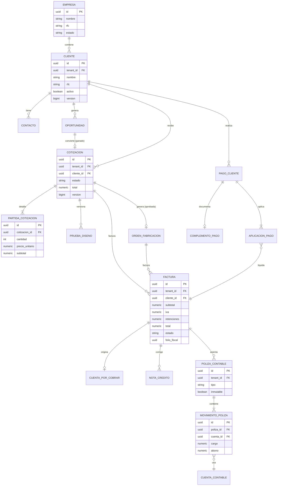

### Diagrama ER — Módulos nuevos (estrategia, productos e inventario avanzado)

Diagrama compacto (independiente del anterior) que muestra únicamente las relaciones clave de los módulos incorporados, para no sobrecargar el diagrama comercial-facturación.

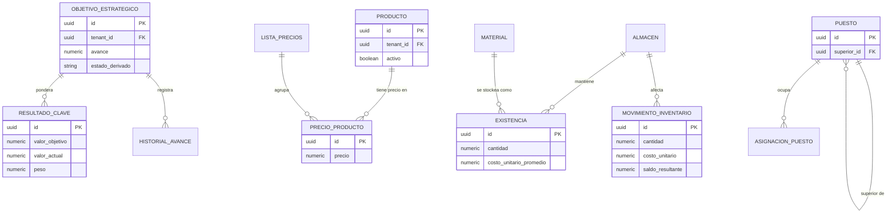

### Diagrama ER — Redes sociales y mensajería omnicanal (Req 64–66)

Diagrama compacto y **separado** de los anteriores, limitado a las entidades clave de redes sociales para no sobrecargar los ER existentes.

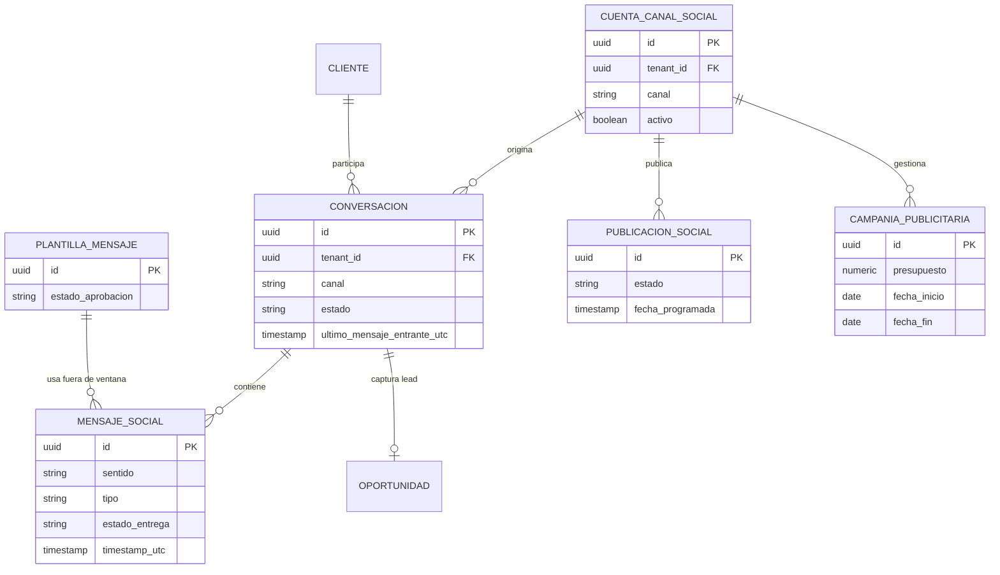

*El Opt_In/Opt_Out (`Consentimiento_Optin`) y las métricas sociales (agregación de solo lectura) se omiten del diagrama por brevedad; se describen en las tablas de entidades anteriores.*

---

## State Machines

Muchos criterios de aceptación se rigen por transiciones de estado explícitas. Cada máquina de estado se implementa en el **dominio** como una función pura que dado `(estadoActual, evento)` devuelve el `estadoSiguiente` o rechaza la transición (Req x.6/x.7 correspondientes). Los estados finales no admiten transiciones posteriores. Cada cambio de estado se audita.

### Cotización (Req 6.6, 6.7)

`borrador → enviada → {aprobada | rechazada}`

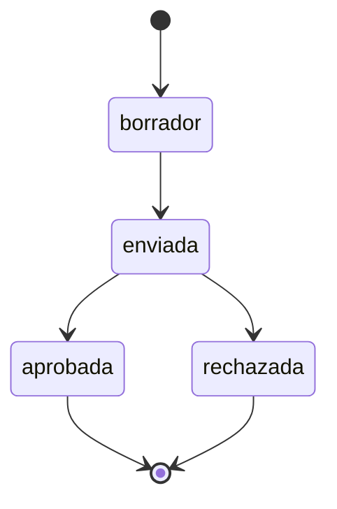

### Orden de Fabricación (Req 7.5, 7.6)

`pendiente → {en_producción | cancelada}`, `en_producción → {terminada | cancelada}`. Finales: `terminada`, `cancelada`.

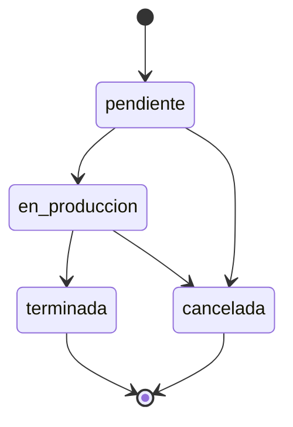

### Oportunidad / Pipeline (Req 14.3, 14.4)

`nuevo → calificado → propuesta → negociación → {ganado | perdido}`, y desde cualquier etapa no final → `perdido`. Finales: `ganado`, `perdido`.

### Permiso de Instalación (Req 17.2, 17.3)

`solicitado → {aprobado | rechazado}`.

### Orden de Trabajo de Instalación (Req 19.5, 19.6)

`programada → {en_curso | cancelada}`, `en_curso → {completada | cancelada}`. `completada` requiere Lista_Pendientes sin ítems abiertos. Finales: `completada`, `cancelada`.

### Ticket de Servicio (Req 20.4, 20.5)

`abierto → asignado → en_proceso → resuelto → cerrado`.

### Requisición de Compra (Req 30.3, 30.4)

`borrador → enviada → {aprobada | rechazada}`. Finales: `aprobada`, `rechazada`, `cancelada`.

### Orden de Compra (Req 31.6, 31.7)

`abierta → {recibida_parcial | cancelada}`, `recibida_parcial → {recibida_total | cancelada}`, `recibida_total → cerrada`. Finales: `cerrada`, `cancelada`.

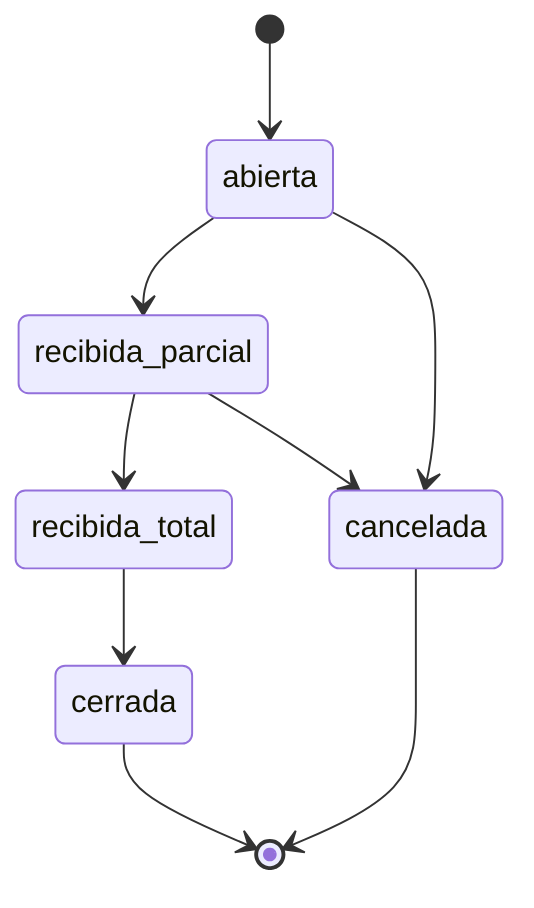

### Factura de Proveedor (Req 33.6)

`registrada → {conciliada | discrepancia}`, `conciliada → pagada`.

### Factura CFDI (Req 35.7)

`borrador → timbrada → cancelacion_en_proceso → cancelada`.

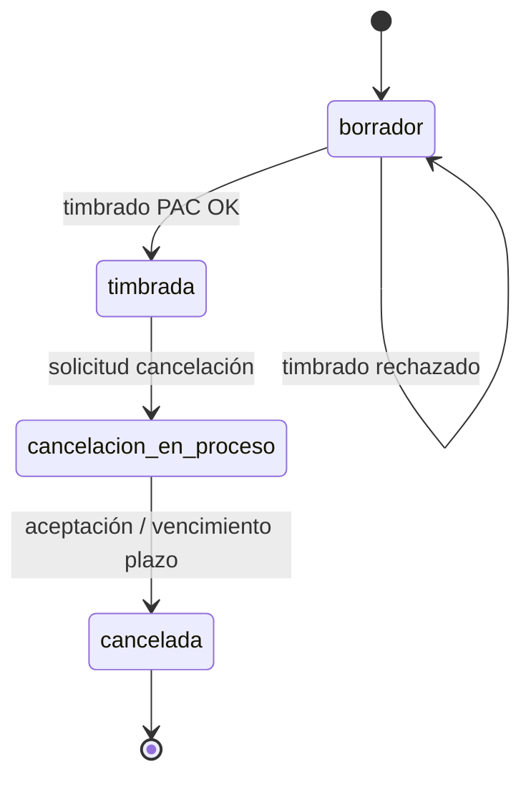

### Nómina (Req 41.5, 41.6)

`borrador → calculada → autorizada → timbrada → pagada`.

### Publicación Social (Req 65.3, 65.4)

`borrador → programada → {publicada | fallida}`. Finales: `publicada`, `fallida`.

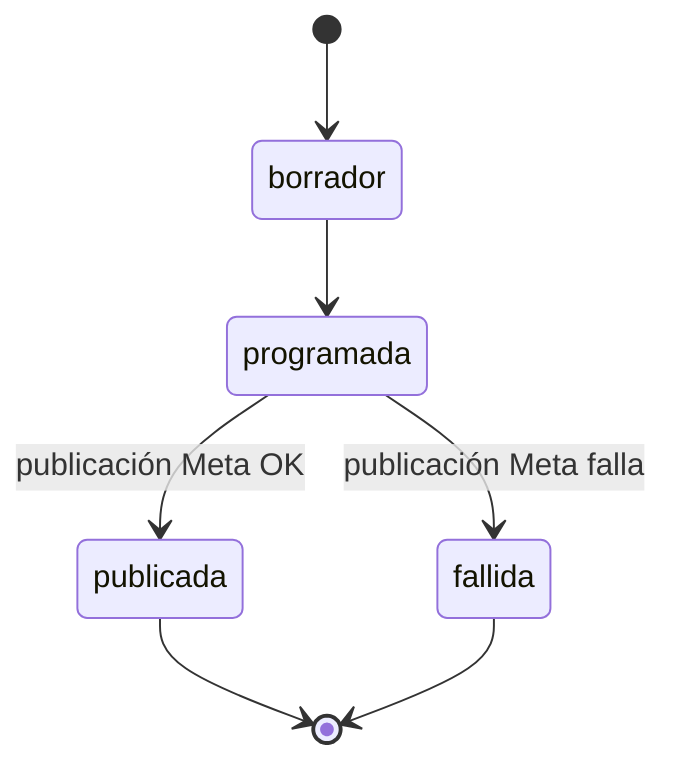

### Conversación y Ventana_Servicio (Req 64.5–64.7)

La `Conversacion` evoluciona por estados operativos (`abierta → asignada → cerrada`) para el seguimiento del handover, pero la regla clave del canal **no** es una máquina de estados con eventos de negocio sino una **guarda temporal**: la **Ventana_Servicio** es el intervalo de 24 horas contado desde `ultimo_mensaje_entrante_utc`. Dentro de ese intervalo se permite responder con texto libre; una vez transcurridas las 24 horas, la guarda exige el uso de una Plantilla_Mensaje aprobada (o mensaje etiquetado) para poder enviar. Por ello la Ventana_Servicio se modela como una **precondición evaluada en el momento del envío** (función pura sobre el reloj y `ultimo_mensaje_entrante_utc`), no como una transición de estado.

### Objetivo Estratégico — estado derivado (Req 58.9, 58.10)

El Objetivo_Estrategico **no** tiene una máquina de estados con eventos; su `estado_derivado` (`en_riesgo | en_curso | cumplido`) es una **derivación de solo lectura** a partir del `avance` (0..100) y del progreso del `periodo`. Regla de derivación:

- `cumplido` cuando `avance = 100`.
- `en_curso` cuando `avance < 100` y el avance es consistente con la fracción del periodo transcurrida.
- `en_riesgo` cuando `avance < 100` y el avance queda por debajo de la fracción del periodo transcurrida (rezago).

El `avance` se calcula como el porcentaje ponderado de cumplimiento de sus Resultado_Clave y **nunca excede 100%**.

---

### Acción Correctiva (Req 70.2, ISO 9001:2026 cláusula 10.2)

Estados: `abierta`, `en_analisis`, `en_ejecucion`, `verificacion`, `cerrada` (final).

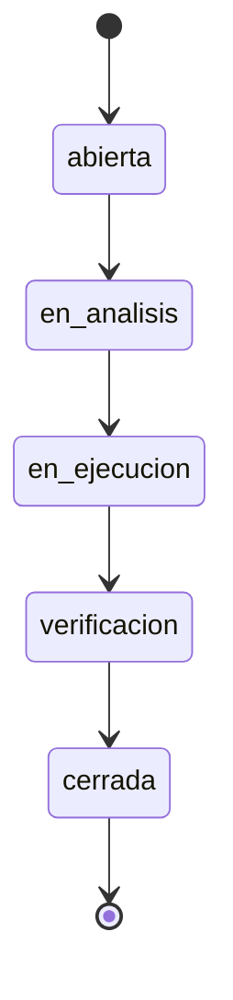

Transiciones permitidas: `abierta→en_analisis`, `en_analisis→en_ejecucion`, `en_ejecucion→verificacion`, `verificacion→cerrada`. Cualquier otra transición se rechaza (409) conservando el estado. El paso a `cerrada` exige `eficacia_verificada = true` (regla de negocio en el servicio, análoga a la guarda de cierre de la Orden de Trabajo de Instalación). Implementada con el `MaquinaEstados<E>` común.

### Cambio del SGC (Req 70.4, ISO 9001:2026 cláusula 6.3)

Estados: `propuesto`, `aprobado`, `implementado` (final), `rechazado` (final).

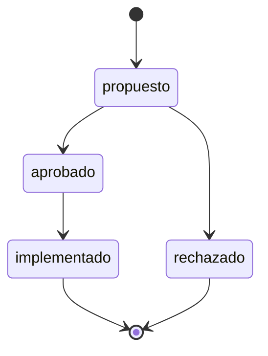

El paso a `aprobado` exige que estén presentes propósito, consecuencias, recursos y responsable (Req 70.4); la aprobación se audita con actor y marca temporal UTC.
## Correctness Properties

*Una propiedad es una característica o comportamiento que debe cumplirse en todas las ejecuciones válidas de un sistema; en esencia, es un enunciado formal de lo que el sistema debe hacer. Las propiedades sirven de puente entre las especificaciones legibles por humanos y las garantías de corrección verificables por máquina.*

Las siguientes propiedades se derivan del análisis de prework de los criterios de aceptación testables. Cada una está universalmente cuantificada y es apta para pruebas basadas en propiedades (property-based testing). Las propiedades de máquinas de estado y de totales monetarios se consolidaron para evitar redundancia (ver *Property Reflection* del prework).

### Property 1: Aislamiento multi-empresa (tenant isolation)

*Para cualquier* conjunto de datos de negocio distribuidos entre varias Empresas y *para cualquier* Usuario autenticado que no sea Super_Administrador, toda operación de lectura, modificación o referencia devuelve o afecta únicamente registros cuyo `tenant_id` coincide con la Empresa del Usuario; cualquier intento de acceder a un recurso de otra Empresa resulta en 404 y el `tenant_id` nunca se toma de parámetros de la petición.

**Validates: Requirements 23.2, 23.3, 23.4, 45.4**

### Property 2: Totales monetarios de documentos con partidas

*Para cualquier* documento con partidas (Cotizacion u Orden_Compra) con cantidades en 1..999,999 y precios unitarios en 0.01..999,999,999.99, el subtotal de cada partida es igual a `round(cantidad × precio_unitario, 2)` y el total del documento es igual a `round(Σ subtotales, 2)`, con redondeo al valor más cercano y aritmética decimal (NUMERIC).

**Validates: Requirements 6.3, 6.5, 31.3, 31.5**

### Property 3: Rechazo de partidas fuera de rango

*Para cualquier* partida cuya cantidad esté fuera de 1..999,999 o cuyo precio unitario esté fuera de 0.01..999,999,999.99, el sistema rechaza la partida y no calcula su subtotal.

**Validates: Requirements 6.4, 31.4**

### Property 4: Cálculo fiscal de la Factura (CFDI)

*Para cualquier* Factura con subtotal válido y retenciones aplicables, el IVA es igual a `round(subtotal × 0.16, 2)` y el total es igual a `round(subtotal + IVA − retenciones, 2)`, con aritmética decimal.

**Validates: Requirements 34.2**

### Property 5: Transiciones de estado válidas (máquinas de estado)

*Para cualquier* máquina de estado del sistema (Cotizacion, Orden_Fabricacion, Oportunidad, Permiso_Instalacion, Orden_Trabajo_Instalacion, Ticket_Servicio, Requisicion_Compra, Orden_Compra, Factura_Proveedor, Factura CFDI, Nomina y Publicacion_Social) y *para cualquier* par (estado actual, evento), la transición se acepta si y solo si pertenece al conjunto de transiciones definidas para esa máquina; toda transición que parta de un estado final se rechaza y el estado se conserva sin cambios.

**Validates: Requirements 6.6, 6.7, 7.5, 7.6, 14.3, 14.4, 17.2, 17.3, 19.5, 20.4, 20.5, 30.3, 30.4, 31.6, 31.7, 33.6, 35.7, 41.5, 41.6, 65.3, 65.4**

### Property 6: Guarda de cierre de Orden de Trabajo de Instalación

*Para cualquier* Orden_Trabajo_Instalacion, la transición a "completada" se permite si y solo si su Lista_Pendientes no contiene ningún elemento sin resolver.

**Validates: Requirements 19.6**

### Property 7: Precondiciones para generar Orden de Fabricación

*Para cualquier* Cotizacion, la generación de una Orden_Fabricacion se permite si y solo si la Cotizacion está en estado "aprobada", no tiene ya una Orden_Fabricacion vinculada, y existe al menos una Prueba_Diseno en estado "aprobada".

**Validates: Requirements 7.1, 7.2, 7.3, 15.5**

### Property 8: Versionado monótono de Pruebas de Diseño

*Para cualquier* Prueba_Diseno en estado "pendiente" que sea rechazada, el sistema conserva el historial y genera una nueva Prueba_Diseno con número de versión igual al anterior más 1 y estado "pendiente".

**Validates: Requirements 15.3, 15.4**

### Property 9: No negatividad de existencias de inventario

*Para cualquier* secuencia de Movimiento_Inventario sobre un Material, las existencias resultantes equivalen a la suma con signo de los movimientos aplicados y nunca son negativas; una salida que dejaría las existencias por debajo de 0 se rechaza y conserva las existencias sin cambios.

**Validates: Requirements 18.2, 18.3, 18.4**

### Property 10: Recepción de mercancía acotada por lo ordenado

*Para cualquier* Orden_Compra y *para cualquier* conjunto de Recepcion_Mercancia, la cantidad recibida acumulada por Partida_Orden_Compra nunca excede la cantidad ordenada; una recepción que provocaría exceso se rechaza y no altera existencias.

**Validates: Requirements 32.3**

### Property 11: Estado de Orden de Compra derivado de las recepciones

*Para cualquier* Orden_Compra, tras registrar recepciones su estado es "recibida_total" si todas las partidas quedan completamente recibidas, y "recibida_parcial" si al menos una partida quedó parcialmente recibida sin completarse el total.

**Validates: Requirements 32.5, 32.6**

### Property 12: Conciliación de tres vías nunca autoriza fuera de tolerancia

*Para cualquier* combinación de Orden_Compra, Recepcion_Mercancia y Factura_Proveedor, la conciliación autoriza el pago (estado "conciliada") si y solo si, por cada partida, la cantidad facturada no excede la cantidad recibida y el precio facturado coincide con el de la Orden_Compra dentro de la tolerancia configurable; en cualquier otro caso marca "discrepancia" y no autoriza el pago.

**Validates: Requirements 33.3, 33.4, 33.5**

### Property 13: Aplicación de pago de cliente acotada por el saldo

*Para cualquier* Cuenta_Por_Cobrar y *para cualquier* Pago_Cliente aplicado, el saldo resultante es el saldo anterior menos el monto aplicado y nunca es negativo; una aplicación que exceda el saldo pendiente se rechaza y conserva los saldos sin cambios.

**Validates: Requirements 36.2, 36.3**

### Property 14: Nota de crédito acotada por el saldo de la factura

*Para cualquier* Nota_Credito que referencie una Factura timbrada, su monto no excede el saldo pendiente de la Factura; una Nota_Credito con monto en exceso se rechaza y conserva la Factura y su Cuenta_Por_Cobrar sin cambios.

**Validates: Requirements 37.2**

### Property 15: Cuenta por pagar acotada por el saldo

*Para cualquier* Cuenta_Por_Pagar y *para cualquier* pago aplicado, el saldo resultante es el saldo anterior menos el monto aplicado y nunca es negativo; un pago que exceda el saldo se rechaza sin cambios.

**Validates: Requirements 42.3, 42.4**

### Property 16: Póliza contable balanceada

*Para cualquier* Poliza_Contable generada, la suma de los cargos es igual a la suma de los abonos; una póliza no balanceada se rechaza y no se persiste.

**Validates: Requirements 38.2, 38.3, 38.4**

### Property 17: Ecuación contable del balance general

*Para cualquier* conjunto de Poliza_Contable balanceadas de un periodo, el balance general derivado cumple que el activo es igual a la suma del pasivo y el capital.

**Validates: Requirements 47.3**

### Property 18: Conciliación bancaria completa solo con diferencia cero

*Para cualquier* conjunto de Movimiento_Bancario y sus emparejamientos, la Conciliacion_Bancaria se considera completa si y solo si la diferencia entre el saldo bancario y el saldo contable es 0 una vez explicadas las partidas; los movimientos sin coincidencia se marcan como excepción.

**Validates: Requirements 43.3, 43.4, 43.5**

### Property 19: Identidad aritmética de la nómina

*Para cualquier* Empleado con datos fiscales completos, el neto a pagar calculado es igual a las percepciones menos las deducciones más el subsidio al empleo cuando corresponda, redondeado, y nunca es negativo.

**Validates: Requirements 41.1, 41.2**

### Property 20: Integridad de la cadena de auditoría

*Para cualquier* secuencia de Registro_Auditoria, el hash de cada entrada se calcula a partir de su contenido y del hash de la entrada anterior; cualquier manipulación posterior de cualquier entrada rompe la verificación de la cadena y es detectable.

**Validates: Requirements 10.4, 10.7**

### Property 21: Inmutabilidad de CFDI y recibos timbrados

*Para cualquier* Factura, Nota_Credito o Recibo_Nomina en estado "timbrada"/timbrado, todo intento de modificar sus datos fiscales se rechaza y se conservan el CFDI y su Folio_Fiscal como histórico.

**Validates: Requirements 35.3, 35.6, 37.3, 41.7**

### Property 22: Unicidad de identificadores de negocio por tenant

*Para cualquier* par de Clientes (o Proveedores) activos, la colisión de identificador fiscal se detecta y rechaza únicamente cuando ambos pertenecen al mismo `tenant_id`; el mismo identificador fiscal en Empresas distintas se permite.

**Validates: Requirements 5.3, 23.6, 29.3**

### Property 23: Validación de datos de entrada

*Para cualquier* petición de registro/actualización, una entrada que incumple las reglas de formato, tipo u obligatoriedad se rechaza con 400 y no se persiste ningún dato; una entrada válida se procesa.

**Validates: Requirements 5.1, 5.2, 8.1, 8.2, 29.1, 29.2, 40.1, 40.2, 44.1, 44.2**

### Property 24: Acotación y metadatos de paginación

*Para cualquier* solicitud de listado, el tamaño de página efectivo respeta el rango 1..100 con valor por defecto 20, y los metadatos cumplen `totalPages = ceil(totalElements / size)`; una solicitud con tamaño superior a 100 se rechaza conforme al requisito aplicable.

**Validates: Requirements 5.7, 6.8, 7.7, 7.8, 12.1, 14.7, 24.5**

### Property 25: Autorización RBAC con denegación por defecto

*Para cualquier* Usuario autenticado y *para cualquier* operación, la operación se autoriza si y solo si algún Rol del Usuario posee el Permiso atómico requerido; en ausencia de ese Permiso (o de Rol válido) la operación se deniega con 403, evaluada siempre dentro del `tenant_id` del Usuario.

**Validates: Requirements 3.1, 3.2, 3.5, 3.6, 25.4**

### Property 26: Vigencia acotada de los tokens

*Para cualquier* Token_Acceso emitido, su vigencia (`exp − iat`) no excede 15 minutos, y *para cualquier* Token_Refresco emitido, su vigencia no excede 7 días.

**Validates: Requirements 1.4, 1.7**

### Property 27: Bloqueo por intentos fallidos

*Para cualquier* secuencia de intentos de inicio de sesión sobre una misma cuenta, tras 5 fallos consecutivos dentro de una ventana de 15 minutos la cuenta queda bloqueada durante 15 minutos y el contador de fallos se reinicia a 0 al expirar el bloqueo.

**Validates: Requirements 2.1, 2.2**

### Property 28: Límite de usuarios del Plan

*Para cualquier* Plan con un máximo de N Usuarios y *para cualquier* secuencia de altas, la creación del Usuario N+1 dentro de la Empresa se rechaza informando el límite alcanzado.

**Validates: Requirements 25.3**

### Property 29: Avance de Objetivo Estratégico acotado y ponderado

*Para cualquier* Objetivo_Estrategico con un conjunto de Resultado_Clave, su avance calculado es igual al porcentaje ponderado de cumplimiento de sus resultados clave (según sus pesos), siempre está dentro del rango [0, 100] y **nunca excede 100**.

**Validates: Requirements 58.8, 58.9**

### Property 30: Rango de precios de Producto

*Para cualquier* precio de Producto definido en una Lista_Precios, el precio se acepta si y solo si está dentro del rango 0.01..999,999,999.99; un precio fuera de rango se rechaza y no se persiste.

**Validates: Requirements 59.3, 59.10**

### Property 31: No negatividad y perpetuidad de existencias por Almacén

*Para cualquier* secuencia de Movimiento_Inventario sobre un Material en un Almacén, las existencias resultantes equivalen a la suma con signo de los movimientos aplicados y nunca son negativas; el saldo se actualiza tras cada movimiento (inventario perpetuo) y una salida que dejaría las existencias por debajo de 0 se rechaza sin cambios.

**Validates: Requirements 60.3, 60.10, 60.12**

### Property 32: Transferencia entre Almacenes conserva cantidad y costo

*Para cualquier* transferencia de existencias entre dos Almacenes, la cantidad de salida en el Almacén origen es igual a la cantidad de entrada en el Almacén destino y el costo se conserva, de modo que la existencia total combinada de ambos Almacenes permanece invariante.

**Validates: Requirements 60.13**

### Property 33: Recosteo correcto según método (promedio/PEPS)

*Para cualquier* secuencia de entradas y salidas sobre un Material con método de costeo promedio ponderado, el costo unitario tras cada entrada es el promedio ponderado de las existencias; y *para cualquier* secuencia con método PEPS, las salidas consumen primero el costo de las capas de inventario más antiguas.

**Validates: Requirements 60.11**

### Property 34: Kardex refleja el saldo acumulado con signo

*Para cualquier* Material/Producto en un Almacén y periodo, el saldo resultante de cada renglón del Kardex es igual al saldo previo más (entradas) o menos (salidas) la cantidad del movimiento, y el saldo final coincide con la existencia registrada.

**Validates: Requirements 60.3, 60.12**

### Property 35: Organigrama sin ciclos

*Para cualquier* asignación de jerarquía entre Puestos, la operación se acepta si y solo si no genera un ciclo (ningún Puesto es su propio superior directo o indirecto); una jerarquía que produciría un ciclo se rechaza y conserva el organigrama sin cambios.

**Validates: Requirements 61.7**

### Property 36: Variación de presupuesto en importe y porcentaje

*Para cualquier* Presupuesto con un importe presupuestado y un importe real derivados, la variación en importe es igual a `real − presupuestado`, la variación porcentual es igual a `round(variacion_importe / presupuestado × 100, 2)` (para presupuestado ≠ 0), y el indicador favorable/desfavorable es consistente con el signo de la variación según el área (ingresos o egresos).

**Validates: Requirements 62.6, 62.7**

### Property 37: Guarda de Ventana_Servicio para envío de mensajes

*Para cualquier* Conversacion y *para cualquier* instante de envío, el envío de un Mensaje_Social de **texto libre** se permite si y solo si el instante está dentro de las 24 horas posteriores al último Mensaje_Social entrante (`ultimo_mensaje_entrante_utc`); fuera de esa ventana el texto libre se rechaza y únicamente se permite el envío mediante una Plantilla_Mensaje aprobada.

**Validates: Requirements 64.6, 64.7**

### Property 38: Guarda de Opt_In para mensajería de marketing

*Para cualquier* Cliente o Contacto y *para cualquier* Canal_Social, el envío de un Mensaje_Social de marketing (o de una Notificacion de marketing por ese canal) se permite si y solo si existe un Opt_In vigente para ese destinatario y canal; en ausencia de consentimiento el envío se rechaza y se registra el motivo de la omisión.

**Validates: Requirements 64.8, 64.9, 46.7**

### Property 39: Validación de presupuesto y periodo de la Campaña_Publicitaria

*Para cualquier* Campaña_Publicitaria, la creación se acepta si y solo si el presupuesto está dentro del rango 0.01..999,999,999.99 y la `fecha_fin` es mayor o igual que la `fecha_inicio`; un presupuesto fuera de rango o una `fecha_fin` anterior a la `fecha_inicio` se rechaza y no se persiste ningún dato.

**Validates: Requirements 65.7, 65.8**

### Property 40: Métricas sociales como agregación de solo lectura y por tenant

*Para cualquier* conjunto de datos de redes sociales de una o varias Empresas y *para cualquier* consulta de métricas por Canal_Social y periodo, el resultado es una agregación que no modifica los datos de origen e incluye únicamente datos cuyo `tenant_id` coincide con la Empresa del Usuario.

**Validates: Requirements 66.1, 66.6**

### Property 41: Revocación de Token_Refresco

*Para cualquier* Token_Refresco que haya sido revocado (por logout, por acción de administrador, por desactivación de la cuenta o por cambio de contraseña), toda solicitud de refresco presentada con ese token se rechaza y el sistema no emite un nuevo Token_Acceso.

**Validates: Requirements 68.1, 68.2, 68.3, 68.4**

### Property 42: Aislamiento del offboarding del tenant

*Para cualquier* exportación o eliminación/anonimización de los datos de una Empresa, la operación incluye o afecta únicamente registros cuyo `tenant_id` coincide con la Empresa objetivo y nunca datos de otras Empresas; además, los comprobantes fiscales bajo retención (Factura CFDI, Recibo_Nomina y Poliza_Contable) se preservan.

**Validates: Requirements 69.3, 69.4, 69.5**

---

### Property 43: Guarda de cierre de Acción Correctiva (eficacia verificada)

*Para cualquier* Accion_Correctiva, la transición a "cerrada" se permite si y solo si su eficacia ha sido verificada (`eficacia_verificada = true`) y el estado de origen es "verificacion"; en cualquier otro caso el cierre se rechaza y el estado se conserva sin modificarlo.

**Validates: Requirements 70.2**
## Error Handling

El manejo de errores prioriza no filtrar detalles internos y ofrecer mensajes de negocio claros (Req 8, 56).

### Estrategia

- **Manejador global** (`@RestControllerAdvice`) traduce excepciones de dominio y de infraestructura a respuestas **Problem Details (RFC 7807)** con `type`, `title`, `status`, `detail` y, para validación, un arreglo `errors` por campo.
- **Sin fugas**: nunca se exponen trazas de pila, mensajes de SQL ni nombres internos; los detalles técnicos se registran en el log del servidor, no en la respuesta (Req 56.4).
- **Idioma**: mensajes de negocio en español, no técnicos, aptos para mostrar al Usuario (Req 56.2).

### Mapa de errores

| Situación | Código HTTP | Requisitos |
|---|---|---|
| Datos de entrada inválidos (incluye precio de Producto o campos de Objetivo/Activo fuera de rango o faltantes) | 400 | 8.2, 5.2, 34.3, 58.3, 59.2, 59.10 |
| No autenticado / token expirado o inválido | 401 | 1.6, 1.9 |
| Token_Refresco revocado o inválido | 401 | 68.3, 1.9 |
| Sin permiso (RBAC deny-by-default, módulo no habilitado) | 403 | 3.2, 3.6, 25.4, 39.4, 47.5, 48.6 |
| Recurso inexistente o de otro tenant (no revelar existencia); incluye intento de exportar/eliminar datos de otra Empresa | 404 | 23.3, 69.5 |
| Conflicto de unicidad (identificador duplicado) | 409 | 4.4, 5.3, 29.3 |
| Conflicto de concurrencia optimista (versión obsoleta) | 409 | 49.2 |
| Transición de estado inválida (incluye Publicacion_Social) | 409/422 | 6.7, 7.6, 14.4, 17.3, 19.6, 20.5, 30.4, 31.7, 33.7, 41.6, 65.4 |
| Regla de negocio incumplida (saldo excedido, existencias insuficientes, discrepancia 3 vías, póliza no balanceada, existencias insuficientes por almacén, jerarquía de Puesto con ciclo) | 409/422 | 18.3, 32.3, 33.4, 36.3, 37.2, 38.4, 42.4, 60.10, 61.7 |
| Envío de Mensaje_Social de texto libre fuera de la Ventana_Servicio sin Plantilla_Mensaje | 409/422 | 64.7 |
| Envío de Mensaje_Social de marketing sin Opt_In vigente | 409/422 | 64.8 |
| Presupuesto o fechas inválidos de Campaña_Publicitaria (o Publicacion_Social sin contenido / fecha pasada) | 400 | 65.2, 65.8 |
| Límite de tasa superado | 429 | 2.4 |
| Cuenta bloqueada temporalmente | 423/401 | 2.2 |
| Fallo de integración externa (PAC/notificación/API de Meta) | 502/503 + reintentos | 35.2, 46.3, 64.13, 65.6 |
| Llave de cifrado no disponible (acceso a datos cifrados) | 503/500 controlado, sin exponer la llave | 67.6 |

### Concurrencia optimista (Req 49)

Toda entidad de negocio modificable lleva `@Version`. Si la versión enviada por el cliente es obsoleta, la escritura se rechaza con **409** e informa que otro Usuario modificó el registro, sin sobrescribir los cambios existentes.

### Errores de integración externa

- **PAC**: un rechazo de timbrado conserva la Factura en "borrador" y devuelve el motivo del PAC (Req 35.2). Fallos transitorios se reintentan según política; los adaptadores encapsulan y traducen errores del proveedor.
- **Notificaciones**: fallos de envío se reintentan conforme a la política configurable, registrando el resultado de cada intento (Req 46.3).
- **APIs de Meta (redes sociales)**: fallos en el envío de Mensaje_Social o en la publicación de contenido se reintentan según la política configurable, registrando el resultado de cada intento (Req 64.13, 65.6); el adaptador de Meta encapsula y traduce los errores del proveedor a códigos 502/503 sin filtrar detalles internos, y una publicación que agota sus reintentos transita a `fallida`.

---

## Testing Strategy

Se adopta un enfoque de pruebas complementario: pruebas unitarias para ejemplos y casos límite, pruebas basadas en propiedades para las invariantes universales, y pruebas de integración/contrato para adaptadores y API.

### Pruebas unitarias (dominio)

- Verifican ejemplos concretos, casos límite y condiciones de error del núcleo de dominio (máquinas de estado, cálculos, validaciones).
- Incluyen ejemplos de tablas fiscales conocidas (ISR/IMSS/Infonavit) para validar importes específicos de nómina que complementan la identidad aritmética de la Property 19.
- Casos de conflicto puntuales (identificador duplicado — Req 4.4) como pruebas de ejemplo.
- **Costeo de inventario** (Req 60.11): ejemplos concretos de recosteo por **costo promedio ponderado** (entradas a distintos costos → costo promedio esperado) y **PEPS** (varias capas consumidas en orden), con importes verificados a mano, que complementan la Property 33.
- **Selección de Lista_Precios** (Req 59.9): ejemplos con varias listas vigentes aplicables a un Cliente para verificar que se aplica la de mayor prioridad o la específica del segmento antes que la general.
- **Estado derivado de Objetivo_Estrategico** (Req 58.10): ejemplos de `en_riesgo | en_curso | cumplido` según avance y periodo transcurrido.

### Pruebas basadas en propiedades (property-based testing)

- **Biblioteca**: se usa **jqwik** (integrada con JUnit 5) para el backend en Java. No se implementa PBT desde cero.
- **Iteraciones**: cada prueba de propiedad se configura con **mínimo 100 iteraciones**.
- **Trazabilidad**: cada prueba de propiedad se etiqueta con un comentario que referencia la propiedad del diseño, con el formato:
  `// Feature: crm-anuncios-luminosos, Property {número}: {texto de la propiedad}`
- **Cobertura**: cada una de las 42 Correctness Properties se implementa con **una** prueba de propiedad. Los generadores producen: montos decimales en los rangos válidos e inválidos (límites incluidos), secuencias de eventos de máquinas de estado, conjuntos de partidas, triples orden/recepción/factura con desviaciones aleatorias, datos multi-tenant, secuencias de intentos de login con marcas de tiempo, cadenas de auditoría, secuencias de movimientos de inventario por almacén (entradas/salidas/transferencias con costeo promedio y PEPS), grafos de jerarquía de Puestos (con y sin ciclos), conjuntos de Resultado_Clave ponderados, pares presupuestado/real por área, secuencias de Mensaje_Social con marcas de tiempo alrededor del límite de 24 horas de la Ventana_Servicio, estados de Opt_In/Opt_Out por destinatario y canal, presupuestos/periodos de Campaña_Publicitaria (válidos e inválidos) y datos sociales multi-tenant para las métricas de solo lectura.
- **Aritmética monetaria**: los generadores y aserciones usan `BigDecimal`/NUMERIC con redondeo *half-up* a 2 decimales, nunca `double`.
- Para Property 12 (tres vías), Property 26/27 (tokens/bloqueo) y Property 20 (auditoría) se usan **mocks/relojes controlados** para mantener el costo bajo y la ejecución determinista.
- **Nuevos módulos**: las Properties 29 (avance ponderado de objetivos), 30 (rango de precios), 31–34 (inventario avanzado: no negatividad/perpetuidad por almacén, transferencias, recosteo promedio/PEPS y Kardex), 35 (organigrama sin ciclos) y 36 (variación de presupuesto) se ejecutan íntegramente en memoria sobre el dominio puro; el recosteo PEPS/promedio usa `BigDecimal` y la detección de ciclos opera sobre el grafo de Puestos generado.
- **Redes sociales (Req 64–66)**: las Properties 37 (Ventana_Servicio) y 38 (Opt_In) se ejecutan sobre el dominio puro con un **reloj controlado** (`Clock` inyectado) para evaluar de forma determinista el límite de 24 horas y el estado de consentimiento vigente; la Property 39 (presupuesto/periodo de Campaña) es aritmética/validación pura; y la Property 40 (métricas sociales de solo lectura por tenant) verifica que la agregación no muta los datos de origen y respeta el `tenant_id`. La integración con las APIs de Meta se prueba con **stubs** (WhatsApp Cloud API, Graph API y Marketing API), de forma análoga al stub del PAC, para no depender de los servicios reales; el envío de Publicacion_Social/Mensaje_Social y su política de reintentos se verifican contra esos dobles.
- **Sesiones y offboarding (Req 68, 69)**: la Property 41 (revocación de Token_Refresco) genera secuencias de emisión y revocación (por logout, admin, desactivación y cambio de contraseña) y verifica que todo refresco revocado se rechaza sin emitir un nuevo Token_Acceso; la Property 42 (aislamiento del offboarding) genera datos multi-tenant y verifica que la exportación y la eliminación/anonimización afectan únicamente el `tenant_id` objetivo y preservan los comprobantes fiscales bajo retención. El cifrado en reposo (Req 67) **no** se expresa como propiedad universal ejecutable; se valida mediante pruebas de integración/configuración (ver más abajo).

### Pruebas de integración (adaptadores)

- **Persistencia + RLS**: pruebas contra PostgreSQL (Testcontainers) que verifican, con 1–3 ejemplos representativos, que las políticas RLS impiden el acceso cruzado entre tenants aun cuando el filtro de aplicación se omitiera, y que la variable `app.current_tenant` se fija por transacción.
- **Adaptador PAC**: pruebas de integración contra un **stub del PAC** que simula timbrado exitoso, rechazo y cancelación, verificando el mapeo de estados de la Factura (Req 35) sin depender del PAC real.
- **Adaptadores de notificación**: pruebas con dobles del proveedor que verifican la política de reintentos (Req 46).
- **Adaptador de Meta (redes sociales)**: pruebas de integración contra **stubs** de WhatsApp Cloud API, Graph API y Marketing API que simulan envío exitoso, fallo con reintentos y consulta de estado de campaña, verificando el mapeo de `estado_entrega` del Mensaje_Social y de la máquina de estados de Publicacion_Social (Req 64, 65) sin depender de Meta.
- **Webhook entrante de Meta**: pruebas del controlador REST dedicado que verifican, con 1–3 ejemplos, la recepción sobre HTTPS/TLS (Req 9), la **validación de firma/autenticidad** del evento, la persistencia del Mensaje_Social entrante y la asociación/creación de Cliente/Contacto/Oportunidad (Req 64.3, 64.4, 64.12).
- **Importación bancaria**: pruebas del adaptador con archivos/respuestas de ejemplo.

### Pruebas de contrato de API

- Validación de la especificación **OpenAPI** contra los controladores (Req 13).
- Pruebas de contrato que verifican formato de paginación, Problem Details, códigos HTTP (400/401/403/404/409/429) y separación DTO/entidad.

### Pruebas de seguridad

- Casos de autorización deny-by-default por rol y por permiso; verificación de que operaciones sin permiso devuelven 403 y que el acceso a otro tenant devuelve 404.
- Verificación de cabeceras de seguridad y redirección TLS a nivel del proxy (integración/smoke, Req 9).
- **Auditoría reforzada** (Req 10.10–10.13): pruebas que verifican el registro de valor anterior/nuevo sin filtrar secretos, la propagación del `trace_id`, el disparo de alertas ante patrones sensibles (con dobles del canal de notificación) y la verificación de la cadena de hash que detecta y reporta una ruptura al alterar un registro.
- **Cifrado en reposo** (Req 67): pruebas de integración/configuración que verifican que los datos sensibles y las credenciales de integraciones quedan **cifrados** en el almacenamiento (no legibles en claro), que el arranque o el acceso **falla de forma controlada** cuando la Llave_Cifrado no está disponible (sin exponer su valor) y una prueba de **rotación de llave** que confirma que los datos previamente cifrados siguen siendo descifrables tras rotar.
- **Revocación de sesiones** (Req 68): pruebas contra el denylist/almacén de refresh tokens que confirman que un Token_Refresco revocado (por logout, admin, desactivación de cuenta o cambio de contraseña) es rechazado (Req 1.9) y que las sesiones activas se listan de forma paginada.
- **Offboarding del tenant** (Req 69): pruebas que verifican la exportación **acotada por `tenant_id`** en formato estructurado y la eliminación/anonimización sin fuga a otros tenants (apoyada en RLS), preservando los comprobantes fiscales bajo retención (Factura CFDI, Recibo_Nomina, Poliza_Contable).

### Pruebas de arranque y configuración (smoke)

- El arranque aborta si falta un secreto requerido (Req 11.2) o una Llave_Cifrado esencial (Req 67.6); disponibilidad de `/actuator/health` (Req 51.4); publicación de OpenAPI/Swagger (Req 13).

### Pruebas de rendimiento

- Pruebas de carga con la concurrencia esperada para verificar p95 de lectura ≤ 2 s y de escritura ≤ 4 s medidos en el servidor (Req 51.1), fuera del alcance de PBT.

### Frontend

- **Pruebas de componente** (Jasmine/Karma o Jest) para componentes del Sistema de Diseño, estados vacíos/error, modales de confirmación y notificaciones toast (Req 54, 56).
- **Pruebas de accesibilidad** con axe-core sobre vistas clave para cubrir WCAG 2.1 AA (Req 57), complementadas con revisión manual con teclado y lector de pantalla.
- **Pruebas e2e** (Cypress/Playwright) para flujos críticos: login, creación de cotización, aprobación de diseño, generación de orden de fabricación, timbrado de factura (con backend/PAC simulado) y navegación responsive por breakpoints (Req 52).
- Verificación de modo claro/oscuro, branding por empresa y respeto a la preferencia de reducción de movimiento (Req 53, 55).

---

## Frontend Design

### Base tecnológica

- **Angular** (última versión estable) + **Angular Material** como base de componentes accesibles.
- **Sistema de Diseño** propio sobre Angular Material mediante **tokens de diseño** (Req 53).
- SPA servida como **archivos estáticos por IIS**; IIS como Proxy Inverso enruta `/` al frontend y `/api` al backend, termina TLS y aplica cabeceras de seguridad (Req 9).

### Estructura de Navegación y Áreas del Sistema

La aplicación se organiza en **capas de acceso** claramente separadas, de modo que cada Usuario navega únicamente por el ámbito que le corresponde según su Rol y su Empresa. La navegación se compone dinámicamente a partir de los Permisos del Usuario (denegación por defecto, Req 3) y siempre dentro del `tenant_id` de su Empresa (Req 23), salvo el ámbito de plataforma del Super_Administrador y el Portal del Cliente, que operan por separado.

El siguiente mapa resume las capas de acceso principales tras la autenticación:

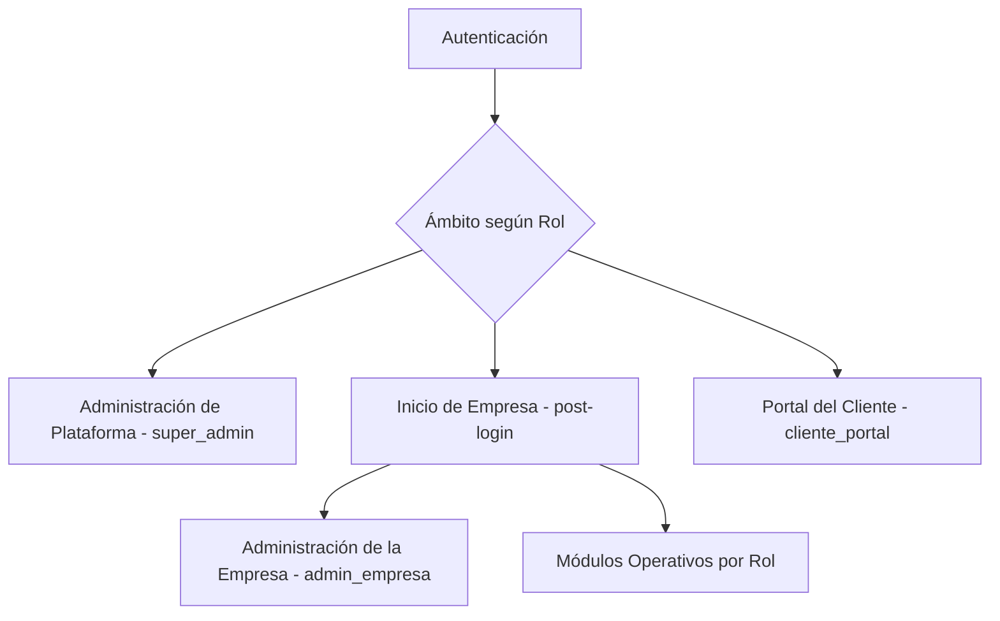

#### 1. Página principal / inicio (post-login)

Tras iniciar sesión, un Usuario de una Empresa accede a un **tablero de bienvenida por Empresa** que reúne, en una sola vista, el rumbo estratégico y el pulso operativo:

- **Esencia de la Empresa**: presentación de la misión, la visión y los valores registrados (Esencia_Empresa, Req 58).
- **Resumen de Objetivos_Estrategicos**: cada Objetivo_Estrategico se muestra con su barra de avance (0–100%) y su estado derivado (en_riesgo, en_curso o cumplido), calculado como agregación de solo lectura a partir de sus Resultado_Clave ponderados (Req 58).
- **Tablero de indicadores por área**: indicadores por área conforme al Req 22, con acceso al análisis avanzado consolidado de Inteligencia_Negocio (Req 48).
- **Branding de la Empresa**: el logotipo y el nombre visible de la Empresa (Req 26) se aplican de forma coherente con el Sistema_Diseno y sus tokens (Req 53), sin romper la armonía visual ni el contraste.

El contenido efectivamente visible en el inicio respeta el control de acceso por roles (Req 3): un área o indicador solo se muestra si el Rol del Usuario posee el Permiso correspondiente, y los datos se limitan al `tenant_id` de la Empresa del Usuario (Req 23).

#### 2. Área de administración de plataforma (Super_Administrador, `super_admin`)

Ámbito de **nivel plataforma**, separado del de negocio, disponible únicamente para el Super_Administrador:

- Gestión de **Empresas (tenants)**: alta, activación, suspensión y consulta (Req 24).
- Gestión de **Planes y Suscripciones**: definición de límites (número de Usuarios, módulos habilitados) y estado de la Suscripcion de cada Empresa (Req 25).
- **Offboarding del tenant**: exportación de los datos de negocio de una Empresa en formato estructurado y su posterior eliminación o anonimización tras el Periodo_Gracia, respetando la retención fiscal (Req 69).

El Super_Administrador **no accede a los datos de negocio** (Clientes, Cotizaciones y demás) de las Empresas, salvo métricas agregadas de operación de la plataforma (Req 24.3). Este ámbito no comparte la navegación de negocio ni el `tenant_id` de ninguna Empresa.

#### 3. Área de administración de la Empresa (`admin_empresa`)

Dentro de cada Empresa (tenant), el Administrador_Empresa dispone de un área de administración para configurar y gobernar su propio ámbito:

- **Usuarios, Roles y Permisos**: gestión de cuentas de Usuario, asignación de Roles y definición de Rol_Personalizado combinando Permisos existentes (Req 4, 27, 28). **Aquí es donde se asignan los roles a cada persona.**
- **Revocación de sesiones**: cierre y revocación de las Sesion de las cuentas de Usuario de la Empresa (Req 68).
- **Personalización de marca (branding)**: configuración del nombre visible y el logotipo de la Empresa (Req 26).
- **Configuración de módulos e integraciones**: habilitación de módulos y configuración de integraciones externas (PAC, Canal_Social, correo), con los secretos gestionados fuera del código conforme al Req 11.
- **Planeación estratégica y presupuestos**: configuración de la misión, visión y valores, los Objetivos_Estrategicos y los Presupuestos de la Empresa (Req 27.14).

Todas estas operaciones se ejecutan estrictamente dentro del `tenant_id` de la Empresa (Req 23) y bajo el control de acceso por roles (Req 3).

#### 4. Módulos operativos (por rol)

La navegación a los módulos operativos se compone **dinámicamente según los Permisos del Rol** del Usuario (deny-by-default, Req 3): cada persona ve únicamente los módulos y las acciones que su función requiere. Los módulos disponibles son: `comercial-crm`, `redes-sociales`, `operacion-produccion` (incluido el inventario avanzado), `mantenimiento`, `compras`, `facturacion-cfdi`, `contabilidad-finanzas`, `rh-nomina` (incluida la organización de personal), `tesoreria`, `activos-fijos`, `estrategia`, `presupuestos`, `reportes-bi` y `calidad` (cumplimiento y calidad ISO 9001:2026: quejas, no conformidades, acciones correctivas, riesgos y oportunidades, gestión del cambio, contexto de la organización e indicadores de cultura de calidad; Req 70).

El modelo de roles del Req 27 gobierna qué ve cada Usuario:

- **Nivel plataforma**: `super_admin` (administración de Empresas, ámbito separado).
- **Nivel empresa**: `admin_empresa`, `gerente`, `supervisor`, `ventas`, `diseño`, `producción`, `almacén`, `instalación`, `mantenimiento`, `contabilidad`, `rh` y `marketing`, cada uno con el alcance definido en el Req 27.
- **Rol externo**: `cliente_portal`, restringido al Portal del Cliente (ver más abajo).
- **Rol_Personalizado**: combinación de Permisos existentes que el Administrador_Empresa define para adaptar la navegación a la estructura de su Empresa (Req 28).

Cada módulo respeta el aislamiento por `tenant_id` (Req 23) y la denegación por defecto (Req 3); un Usuario sin el Permiso requerido no ve la entrada de navegación correspondiente ni puede acceder a sus operaciones.

#### 5. Portal del Cliente (externo, `cliente_portal`, Req 45)

Acceso **restringido y separado** de la navegación interna, para que un Cliente consulte y apruebe únicamente lo relacionado con sus propios proyectos:

- Consulta de sus Cotizaciones, Prueba_Diseno, avance de sus Proyectos y Sitios, sus Ticket_Servicio y sus Facturas.
- Aprobación o rechazo de sus propias Prueba_Diseno.

El Cliente **no accede** a datos de otros Clientes ni a operaciones internas de la Empresa, y su acceso respeta el aislamiento por `tenant_id` (Req 45, Req 23).

> **Transversal a toda la navegación**: la interfaz es responsiva y se adapta a escritorio, tablet y móvil (Req 52); aplica el Sistema_Diseno y sus tokens (Req 53); presenta un Modal_Confirmacion ante acciones sensibles o irreversibles (Req 54); y cumple con la accesibilidad WCAG 2.1 AA (Req 57).

### Sistema de Diseño y tokens (Req 53)

- **Tokens**: paleta de color (base neutra, un primario corporativo, semánticos moderados para éxito/advertencia/error/información), tipografía (jerarquía legible), espaciados, radios y sombras. Definidos como CSS custom properties + tema de Angular Material.
- **Paleta sobria y profesional**, evitando colores estridentes; contraste conforme a WCAG 2.1 AA (Req 53.2, 57.4).
- **Modo claro/oscuro** conmutable preservando contraste (Req 53.5).
- **Branding por empresa** (Req 26, 53.3): nombre visible y logotipo aplicados sobre el tema sin romper armonía ni contraste; los tokens del tenant se cargan tras autenticación.

### Responsive mobile-first (Req 52)

- Enfoque **mobile-first** con **breakpoints** (móvil, tablet, escritorio); operación legible desde 320 px.
- En móvil: navegación colapsable y tablas como vista de tarjetas o con desplazamiento horizontal, sin recortar información.
- Áreas táctiles con tamaño mínimo accesible.

### Interacción y retroalimentación

- **Modales de confirmación** para acciones sensibles/irreversibles (eliminar/desactivar, cancelar cotización/orden, timbrar/cancelar factura, autorizar pago, procesar nómina) con acción primaria y secundaria (Req 54).
- **Notificaciones toast** con el resultado de cada operación; errores de validación mostrados por campo, en lenguaje no técnico (Req 56).
- **Estados vacíos y de error** con acción sugerida (Req 56.3).
- **Animaciones y microinteracciones sutiles**, **skeletons** de carga y prevención de saltos de disposición; respeto a la preferencia de **reducción de movimiento** del sistema (Req 55).

### Accesibilidad (Req 57)

- Cumplimiento **WCAG 2.1 AA**: operación completa por teclado con foco visible, etiquetas y texto alternativo para lectores de pantalla, y contraste suficiente garantizado por el Sistema de Diseño.
- La validación completa requiere pruebas manuales con tecnologías de asistencia y revisión experta además de las verificaciones automatizadas.

### Portal del Cliente (Req 45)

- Aplicación/módulo con alcance restringido (rol `cliente_portal`): el Cliente consulta únicamente su propia información (cotizaciones, pruebas de diseño, avance de proyectos/sitios, tickets y facturas) y aprueba/rechaza sus pruebas de diseño; respeta el aislamiento por `tenant_id`.

### Vistas de los Módulos Nuevos (Req 58–63)

- **Planeación estratégica**: vista de misión/visión/valores y tablero de Objetivos_Estrategicos con barra de avance (0–100%), estado derivado (en_riesgo/en_curso/cumplido) mediante colores semánticos moderados del Sistema de Diseño y detalle de Resultados Clave con su peso.
- **Catálogo de Productos y Listas de Precios**: administración de Productos e información comercial de apoyo; edición de Listas de Precios con vigencia y prioridad; en la Cotización, el precio sugerido se muestra editable.
- **Inventario avanzado**: selector de Almacén, consulta del Kardex (tabla con desplazamiento y vista de tarjetas en móvil), indicadores de stock mínimo/máximo y punto de reorden, y asistente de transferencia entre almacenes con Modal_Confirmacion.
- **Organización de personal**: visualización del organigrama jerárquico, gestión de Puestos y captura de Evaluacion_Desempeno.
- **Presupuestos**: comparativo presupuestado vs. real por área/periodo, resaltando desviaciones por encima del umbral con colores semánticos.
- **Canal de venta**: filtro/segmentación por canal en reportes comerciales y de BI.
- Todas las vistas respetan responsive mobile-first (Req 52), el Sistema de Diseño y tokens (Req 53), y la accesibilidad WCAG 2.1 AA (Req 57).

### Vistas de Redes Sociales y Mensajería Omnicanal (Req 64–66)

- **Bandeja_Unificada (Req 64)**: vista de dos/tres paneles (lista de Conversacion, hilo del mensaje y contexto del CRM) que consolida los tres Canal_Social en un **único hilo por Cliente o Contacto**, con historial compartido. Incluye:
  - **Indicador de Ventana_Servicio**: señal visual (con colores semánticos moderados del Sistema_Diseno) del tiempo restante de las 24 horas; cuando la ventana está cerrada, el compositor deshabilita el texto libre y ofrece el **selector de Plantilla_Mensaje** aprobada.
  - **Compositor** con soporte de mensajes interactivos (botones/listas) donde el canal lo admita, y aviso cuando el destinatario **carece de Opt_In** para mensajería de marketing.
  - **Asignación / handover**: control para asignar o transferir la Conversacion a otro Usuario, conservando el historial.
  - **Filtros** por Canal_Social, Cliente y estado de la Conversacion; vinculación visible al Cliente/Contacto/Oportunidad (captura de leads).
- **Publicación de contenido (Req 65)**: **calendario/editor** de Publicacion_Social para Facebook e Instagram con estado (borrador/programada/publicada/fallida) mediante colores semánticos, y **panel de Campaña_Publicitaria** con presupuesto, periodo y estado externo de solo lectura obtenido de la Marketing API. Las acciones sensibles (programar/publicar) usan Modal_Confirmacion (Req 54).
- **Analítica social (Req 66)**: panel con métricas por Canal_Social y periodo (alcance, interacciones, mensajes recibidos/enviados, tiempo de respuesta, conversiones/leads), con segmentación por canal de venta y exportación; se integra en el Tablero y en la Inteligencia_Negocio.
- Todas estas vistas respetan responsive mobile-first (Req 52) —la Bandeja_Unificada colapsa a un solo panel navegable en móvil—, el Sistema de Diseño y tokens (Req 53), y la accesibilidad WCAG 2.1 AA (Req 57).

---

## Cross-Cutting Concerns

- **Validación** (Req 8): Bean Validation en DTOs + validaciones de dominio; consultas parametrizadas; codificación de salida.
- **Caché** (Req 12.3): catálogos de cambio lento servidos desde caché (Caffeine) con invalidación por escritura.
- **Manejo de errores** (Req 8, 56): Problem Details sin fuga de detalles internos.
- **Concurrencia optimista** (Req 49): `@Version` en entidades modificables; conflicto → 409.
- **Respaldo y recuperación** (Req 50): respaldos periódicos cifrados con RPO/RTO configurables; restauración auditada; acceso restringido.
- **Rendimiento y disponibilidad** (Req 51): paginación, caché, procesamiento asíncrono para operaciones intensivas, health check (`/actuator/health`), objetivos p95 lectura ≤ 2 s / escritura ≤ 4 s.
- **Inteligencia de negocio y reportes** (Req 22, 39, 47, 48, 63, 66): agregaciones de **solo lectura** que no modifican datos de origen, respetando el aislamiento por tenant y el control de acceso por área; exportación con filtros por fecha/cliente/área. Los reportes comerciales admiten **segmentación por canal de venta** (Req 63) y el Tablero incorpora el **avance de Objetivos_Estrategicos** (Req 58), la **variación presupuestal** (Req 62) y las **métricas de redes sociales** por Canal_Social (Req 66).
- **Analítica social** (Req 66): las métricas por Canal_Social y periodo (alcance, interacciones, mensajes, tiempo de respuesta, conversiones/leads) son **agregaciones de solo lectura** que no modifican los datos de origen, se consolidan en el Tablero y la Inteligencia_Negocio (Req 22, 48), admiten segmentación por canal de venta (Req 63) y respetan el aislamiento por `tenant_id` y el control de acceso RBAC (403 sin permiso analítico/comercial).
- **Mensajería omnicanal** (Req 64): integración con las APIs de Meta tras el `MensajeriaSocialPort` desacoplado (portabilidad); webhooks entrantes sobre HTTPS/TLS con validación de firma (Req 9); Ventana_Servicio de 24 h y Plantilla_Mensaje como guardas de envío; Opt_In/Opt_Out para marketing; política de reintentos configurable y auditoría de cada mensaje y cambio de estado.
- **Planeación estratégica** (Req 58): el avance del Objetivo_Estrategico y su estado derivado (en_riesgo/en_curso/cumplido) se calculan como agregación de solo lectura a partir de sus Resultado_Clave ponderados, conservando el historial de actualizaciones.
- **Presupuestos y control de costos** (Req 62): la variación (real − presupuestado, en importe y porcentaje, favorable/desfavorable) se deriva de las operaciones registradas (Facturas, Órdenes de Compra, Nómina) por área y periodo, como agregación de solo lectura que destaca desviaciones por encima del umbral configurable.
- **Inventario avanzado** (Req 60): inventario perpetuo por Almacén con costeo configurable (promedio/PEPS), Kardex de solo lectura, control de lotes con trazabilidad, punto de reorden y notificaciones de stock mínimo/máximo y reabastecimiento; se integra con el inventario base del Req 18.
- **Contabilidad automática** (Req 38): posteo automático de Poliza_Contable balanceada ante eventos relevantes (factura timbrada, pago aplicado, nota de crédito, factura de proveedor conciliada/pagada, movimiento de inventario, depreciación); pólizas inmutables con corrección solo por reverso.
- **Cifrado en reposo** (Req 67): cifrado a nivel de almacenamiento/BD de PostgreSQL, reforzado con cifrado por columna para campos altamente sensibles; Llave_Cifrado gestionada por Req 11 con rotación que preserva el descifrado de datos previos; credenciales de integraciones cifradas; complementa TLS (Req 9) y respaldos (Req 50); bloqueo controlado si la llave no está disponible y auditoría de gestión de llaves sin registrar su valor.
- **Gestión y revocación de sesiones** (Req 68): denylist/almacén de Token_Refresco con revocación en logout, por administrador, por desactivación de cuenta (Req 4.2) y por cambio de contraseña; el Token_Acceso de vida corta (≤ 15 min) acota la ventana residual; consulta paginada de sesiones activas y auditoría.
- **Offboarding y portabilidad del tenant** (Req 69): exportación de datos por `tenant_id` en formato estructurado; Periodo_Gracia configurable tras cancelar la Suscripcion; eliminación/anonimización acotada por tenant apoyada en RLS (Req 23); preservación de comprobantes fiscales por retención; auditoría del proceso.
- **Portabilidad a la nube** (Restricciones): núcleo de dominio sin dependencias de framework; integraciones externas tras puertos con adaptadores intercambiables; empaquetable en contenedores sin reescribir el núcleo.
