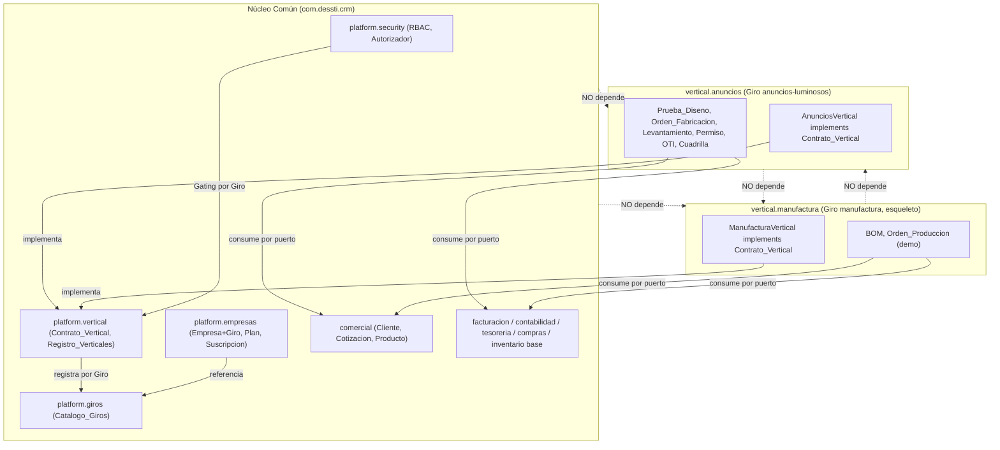
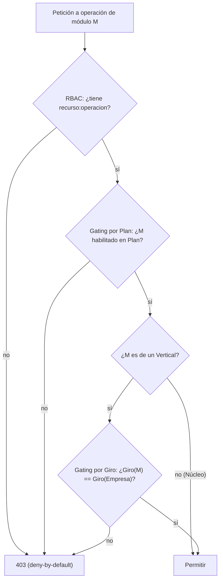

# Documento de Diseño — Plataforma Multigiro (Verticales Enchufables)

## Overview

Este diseño convierte la plataforma Dessti de **monolito modular multiempresa con un único vertical en duro** (anuncios luminosos) en una **plataforma multigiro de verticales enchufables**: un **Núcleo Común** transversal más **Módulos-Vertical** independientes por giro, seleccionables por el Super_Administrador al crear cada Empresa.

El diseño se apoya y **no contradice** los mecanismos ya verificados del spec `crm-anuncios-luminosos`:

- **Empresa = tenant** (su PK es el `tenant_id`; ver `platform/empresas/Empresa.java`). El Giro se añade como **atributo de la Empresa**, no como nuevo eje de aislamiento.
- **Gating por Plan** existente: `@autorizador.moduloHabilitado('modulo')` → `Autorizador.moduloHabilitado()` → `PlanModulosPort` → `PlanModulosPlanAdapter` (Req 25.4). El **Gating por Giro** se añade como un método hermano en el mismo `Autorizador`, componiéndose en la misma expresión `@PreAuthorize`.
- **RBAC de permisos atómicos** `recurso:operacion` (`platform/security/rbac/Permiso.java`, `roles/Rol.java`, `roles/ServicioRoles.java`) con clasificación plataforma/empresa (`roles/ClasificadorRecursosPlataforma.java`). El diseño introduce un **`ClasificadorRecursosVertical`** análogo que resuelve qué recursos pertenecen a qué Giro.
- **Navegación dinámica del frontend** (`core/navigation/navigation.ts`, `features/empresa/empresa.routes.ts`) que ya filtra por permisos; se extiende con un predicado adicional de **Giro activo**.

Las dos entregas son indivisibles: (1) el **andamiaje multigiro** (Catálogo de Giros, selección al alta, Contrato de Vertical, Registro de Verticales, doble gating, RBAC por giro, navegación por giro, migración) y (2) la **extracción del Vertical de Anuncios** como primer plugin real, dejando el Núcleo limpio, más un **esqueleto del Vertical de Manufactura** que prueba el encaje del contrato para N giros.

### Decisiones tomadas con el usuario

- **Comercial base es Núcleo compartido**: Cliente, Contacto, Oportunidad, Cotización, Producto, Lista_Precios, Canal_Venta son transversales a todo giro. Prueba_Diseno (hoy en `comercial/pruebadiseno`) es **específica de anuncios** y se mueve al vertical.
- **Manufactura es andamiaje de demostración**: el diseño define el esqueleto del `Vertical_Manufactura` que implementa el Contrato_Vertical y prueba el aislamiento; su implementación funcional completa queda como tarea **opcional** marcada con `*`.

## Architecture

### Frontera Núcleo vs Vertical (Req 5)

La frontera se traza por **transversalidad**: una capacidad es Núcleo si aplica a *todo* giro; es Vertical si su flujo/entidades solo tienen sentido en *un* giro.

| Capa | Contenido | Paquete raíz | Clasificación |
|------|-----------|--------------|---------------|
| Núcleo — plataforma | Seguridad, RBAC, auditoría, tenant, empresas, planes, suscripciones, monetización, giros, registro de verticales | `platform` | **Núcleo** |
| Núcleo — comercial base | Cliente, Contacto, Oportunidad, Cotización, Producto, Lista_Precios, Canal_Venta | `comercial` (sin `pruebadiseno`) | **Núcleo** |
| Núcleo — administrativo/financiero | Facturación CFDI, contabilidad, tesorería, compras, inventario base, RH-nómina, activos fijos, presupuestos, estrategia, notificaciones, reportes-BI base, calidad, social | `facturacion`, `contabilidad`, `tesoreria`, `compras`, `operacion/inventario`, `rhnomina`, `activosfijos`, `presupuestos`, `estrategia`, `notificaciones`, `reportesbi`, `calidad`, `social` | **Núcleo** |
| Vertical — anuncios | Prueba_Diseno, Orden_Fabricacion, Levantamiento_Sitio, Permiso_Instalacion, Orden_Trabajo_Instalacion, Cuadrilla, Proyecto/Sitio del vertical, parte vertical de Mantenimiento | `vertical.anuncios` (nuevo) | **Vertical** |
| Vertical — manufactura (esqueleto) | BOM, Orden_Produccion, Planeacion (demostración) | `vertical.manufactura` (nuevo) | **Vertical** |

Nota sobre `inventario`: el inventario **base** (Material, Movimiento_Inventario, Almacen, Lote, Kardex) es Núcleo, porque manufactura también lo necesita. Solo los flujos que *consumen* inventario de forma específica del giro (p. ej. consumo por Orden_Fabricacion de anuncios) viven en el vertical y lo hacen **por puerto**.

### Diagrama de dependencias (hexagonal)



El Núcleo depende **solo** del `Contrato_Vertical` (puerto). Los verticales dependen del Núcleo (por puertos) y del contrato, pero **nunca entre sí** (Req 4.2, 4.6, 5.4).

### Contrato de Vertical y registro (Req 4)

El `Contrato_Vertical` es un puerto que cada vertical implementa como un bean Spring. El `Registro_Verticales` los inyecta como `List<ContratoVertical>` y los indexa por su clave de Giro, fallando el arranque si hay claves duplicadas (Req 4.4).

```mermaid
sequenceDiagram
    participant Spring as ContextoSpring
    participant Reg as RegistroVerticales
    participant VA as AnunciosVertical
    participant VM as ManufacturaVertical
    Spring->>Reg: inyecta List<ContratoVertical> = [VA, VM]
    Reg->>VA: giro()  => "anuncios-luminosos"
    Reg->>VM: giro()  => "manufactura"
    Reg->>Reg: indexar por giro; detectar duplicados
    alt clave de giro duplicada
        Reg-->>Spring: IllegalStateException (falla el arranque, Req 4.4)
    else claves únicas
        Reg-->>Spring: registro listo (giro -> ContratoVertical)
    end
```

### Doble gating: por Plan y por Giro (Req 6)

Ambos controles se evalúan en la misma expresión `@PreAuthorize` y se **componen con AND**. El gating por giro se resuelve a partir del Giro de la Empresa (por `tenant_id` del contexto) y del Giro que aporta el módulo (según el `Registro_Verticales`).



El Núcleo no aplica gating por giro (Req 6.4). Un módulo vertical exige ambas condiciones (Req 6.2, 6.3).

## Components and Interfaces

### Núcleo — Contrato y registro de verticales (nuevo paquete `platform.vertical`)

- **`ContratoVertical`** (puerto de entrada del plugin). Interfaz que cada vertical implementa:
  - `String giro()` — clave canónica del Giro (normalizada, p. ej. `anuncios-luminosos`).
  - `Set<String> modulos()` — claves de módulo que aporta el vertical (para componer con el catálogo de módulos/gating por plan).
  - `Set<String> recursos()` — recursos RBAC atómicos que introduce el vertical (para el `ClasificadorRecursosVertical`).
  - `List<ItemNavegacionVertical> navegacion()` — metadato de navegación del vertical (etiqueta, ruta, icono, permiso requerido), consumido por el endpoint de contexto de sesión del frontend.
- **`RegistroVerticales`** (componente del Núcleo). Descubre `List<ContratoVertical>`, valida unicidad de Giro (Req 4.4), y expone:
  - `Optional<ContratoVertical> porGiro(String giro)`.
  - `Optional<String> giroDeModulo(String modulo)` — resuelve a qué Giro pertenece un módulo (o vacío si es Núcleo).
  - `Set<String> girosRegistrados()`.
- **`ItemNavegacionVertical`** (record): `etiqueta`, `ruta`, `icono`, `recurso`, `operacion`.

Regla de dependencias (verificada con ArchUnit, Req 4.2/4.6): `platform.vertical` no importa `vertical.*`; `vertical.anuncios` no importa `vertical.manufactura` ni viceversa.

### Núcleo — Catálogo de Giros (nuevo paquete `platform.giros`)

Sigue el patrón hexagonal existente (dominio + application + adapter, como `platform.monetizacion`).

- **`Giro`** (entidad JPA, tabla `giro`): `id UUID`, `clave` (única, normalizada), `nombre_visible`, `descripcion`, `activo boolean`, columnas de auditoría/`version`. **Sin RLS** (dato de plataforma, coherente con `empresa`, Req 8.4).
- **`GiroRepository`** (puerto out) / adaptador JPA.
- **`ServicioGiros`** (application): `crear`, `activar`, `desactivar`, `listar` (paginado, filtro por estado). Reglas: clave única (422 si duplicada, Req 1.3); no desactivar giro en uso (422 con conteo, Req 1.5); auditoría en cada operación (Req 1.7).
- **REST** `GiroController` bajo `/api/v1/plataforma/giros`, protegido por `@PreAuthorize("@autorizador.tiene('giro','...')")`. El recurso `giro` es **de plataforma** (se añade a `ClasificadorRecursosPlataforma`).

### Núcleo — Empresa con Giro (modificación de `platform.empresas`)

- **`Empresa`**: nueva columna `giro_id UUID NOT NULL` (FK a `giro.id`), con getter `getGiroId()`. El método de fábrica `Empresa.crear(...)` pasa a exigir `giroId` (regla de dominio: obligatorio, Req 2.1/2.2). Se añade `cambiarGiro(UUID nuevoGiroId, String actor)` con la regla del Req 3 (validación de datos del vertical la aplica el servicio).
- **`CrearEmpresaCommand`**: nuevo campo `UUID giroId` (obligatorio).
- **`ServicioEmpresas.crearEmpresa`**: valida que el Giro exista y esté activo (422 si no, Req 2.2); registra el Giro en la auditoría del alta (Req 2.5).
- **`ServicioEmpresas.cambiarGiro`** (nuevo): comprueba mediante puertos de existencia de datos del vertical (`DatosVerticalPort` por giro) si la Empresa tiene datos; 422 si los tiene (Req 3.2); auditoría con giro anterior/nuevo (Req 3.3).
- **`GiroEmpresaPort`** (puerto en `platform.security`, análogo a `PlanModulosPort`): `Optional<String> giroDeTenant(UUID tenantId)`. Adaptador `GiroEmpresaAdapter` en `platform.empresas`.

### Núcleo — Autorización consciente del Giro (`platform.security`)

- **`Autorizador.giroCorresponde(String modulo)`** (método nuevo, hermano de `moduloHabilitado`): resuelve el Giro del módulo vía `RegistroVerticales.giroDeModulo(modulo)`; si el módulo es Núcleo (vacío) devuelve `true` (Req 6.4); si es vertical, compara con `GiroEmpresaPort.giroDeTenant(tenantActual)` (Req 6.1). Deny-by-default ante ausencia de tenant/autenticación. Audita denegaciones por giro (Req 6.5) vía `AuditoriaPort`.
- Uso en verticales:
  ```java
  @PreAuthorize("@autorizador.moduloHabilitado('anuncios') "
      + "and @autorizador.giroCorresponde('anuncios') "
      + "and @autorizador.tiene('prueba_diseno','crear')")
  ```
- **`ClasificadorRecursosVertical`** (análogo a `ClasificadorRecursosPlataforma`): resuelve, vía `RegistroVerticales`, si un recurso pertenece a un vertical y a cuál Giro. Lo usa `ServicioRoles` para:
  - Ofrecer al `admin_empresa` solo permisos aplicables al Giro de su Empresa (Req 7.3).
  - Rechazar (422) un `Rol_Personalizado` con permisos de un vertical ajeno al Giro (Req 7.4).

### Frontend — Contexto de sesión y navegación por Giro

- **Contexto de sesión**: el endpoint de sesión/login incluye `giro` (clave del Giro de la Empresa) y la `navegacion` del vertical activo (derivada del `ContratoVertical`), además de los permisos (Req 9.1).
- **`AuthService`**: nuevo signal `giro()` y helper `esGiro(clave)`.
- **`NavigationService`** (`core/navigation/navigation.ts`): los items del vertical se separan de `itemsEmpresa` (que queda solo con Núcleo) y se **inyectan dinámicamente** desde el contexto de sesión del vertical activo; cada item mantiene su predicado por permiso (deny-by-default) y se filtra además por Giro (Req 9.2, 9.3).
- **`empresa.routes.ts`**: las ramas del vertical (`operacion` de anuncios, `mantenimiento` vertical) se cargan tras una nueva **`guardaGiro(clave)`** que verifica el Giro del contexto y redirige a `/acceso-denegado` si no corresponde (Req 9.4). Las ramas de Núcleo (comercial, compras, facturación, etc.) no cambian.
- Los ámbitos `/plataforma` y `/portal` **no** dependen del Giro (Req 9.5).

## Data Models

### Tabla `giro` (nueva, migración Flyway `V50`)

| Columna | Tipo | Reglas |
|---------|------|--------|
| `id` | UUID PK | |
| `clave` | VARCHAR(60) UNIQUE NOT NULL | normalizada a minúsculas, formato kebab |
| `nombre_visible` | VARCHAR(150) NOT NULL | |
| `descripcion` | TEXT | opcional |
| `activo` | BOOLEAN NOT NULL DEFAULT true | |
| `version`, `created_at`, `updated_at`, `created_by`, `updated_by` | | auditoría estándar |

Sin políticas RLS (dato de plataforma, Req 8.4). Se siembra el giro `anuncios-luminosos` (activo) en esta migración (Req 11.1).

### Tabla `empresa` (modificación, migración Flyway `V51`)

- Añade `giro_id UUID` con FK a `giro(id)`.
- Backfill: `UPDATE empresa SET giro_id = (SELECT id FROM giro WHERE clave='anuncios-luminosos') WHERE giro_id IS NULL;` (Req 11.2).
- Tras el backfill, `ALTER TABLE empresa ALTER COLUMN giro_id SET NOT NULL;` (Req 2.3). Migración no destructiva y versionada (Req 11.3); si el backfill no puede completarse, la transacción de Flyway falla y no deja estado parcial (Req 11.4).

### Permisos y recursos de vertical (migración Flyway de siembra por vertical)

- Recurso de plataforma nuevo: `giro` con operaciones `crear/listar/activar/desactivar`, asignado a `super_admin`.
- Recursos del `Vertical_Anuncios` (`prueba_diseno`, `orden_fabricacion`, `levantamiento_sitio`, `permiso_instalacion`, `orden_trabajo_instalacion`, `cuadrilla`, y los del mantenimiento vertical) **ya existen** en las migraciones V5/V17-V20/V24-V27; el diseño **no los duplica**: solo los reclasifica como pertenecientes al Giro `anuncios-luminosos` vía el `ContratoVertical.recursos()` y el `ClasificadorRecursosVertical` (sin nueva siembra, evitando duplicación, Req 13.3).

## Correctness Properties

*Una propiedad es una característica o comportamiento que debe cumplirse en todas las ejecuciones válidas del sistema — esencialmente, una afirmación formal sobre lo que el sistema debe hacer. Las propiedades son el puente entre la especificación legible por humanos y las garantías de corrección verificables por máquina.*

Estas propiedades se implementan con **jqwik** (ya presente en el proyecto, ver `.jqwik-database`), mínimo 100 iteraciones cada una. Las reglas estructurales (dependencias entre módulos) se verifican con **ArchUnit** y la migración/RLS con **IT de Testcontainers**; esas no son propiedades universales de datos.

### Property 1: Normalización idempotente de la clave de Giro

*Para toda* cadena de entrada, la clave de Giro normalizada está en minúsculas y sin espacios envolventes, y volver a normalizar el resultado produce la misma clave (idempotencia).

**Validates: Requirements 1.2**

### Property 2: El Registro de Verticales indexa cada Giro

*Para todo* conjunto de implementaciones de `ContratoVertical` con claves de Giro distintas, el `RegistroVerticales` recupera con `porGiro(g)` exactamente el contrato cuya clave es `g` para cada Giro, y `girosRegistrados()` es igual al conjunto de claves de entrada.

**Validates: Requirements 4.3**

### Property 3: El Registro de Verticales rechaza Giros duplicados

*Para toda* lista de implementaciones de `ContratoVertical` que contenga al menos dos elementos con la misma clave de Giro, construir el `RegistroVerticales` lanza siempre un error de arranque (`IllegalStateException`).

**Validates: Requirements 4.4**

### Property 4: Composición del doble gating (Plan Y Giro)

*Para toda* operación de un módulo `M`, para todo estado de habilitación de `M` en el Plan, para todo Giro de la Empresa y todo Giro del módulo, la decisión de autorización efectiva es verdadera si y solo si el permiso RBAC está concedido Y `M` está habilitado en el Plan Y (`M` es de Núcleo O el Giro de `M` coincide con el Giro de la Empresa).

**Validates: Requirements 6.1, 6.2, 6.3, 6.4, 12.4**

### Property 5: El Núcleo nunca se bloquea por Giro

*Para todo* módulo cuyo Giro resuelto por el `RegistroVerticales` es vacío (módulo de Núcleo) y *para todo* Giro de Empresa, `giroCorresponde(modulo)` devuelve verdadero.

**Validates: Requirements 6.4**

### Property 6: Los permisos aplicables se clasifican por Giro

*Para todo* Giro `g` y todo catálogo de recursos compuesto por recursos de Núcleo y recursos de varios verticales, el conjunto de permisos aplicables a `g` contiene todos los recursos de Núcleo y los del vertical de `g`, y no contiene ningún recurso perteneciente a un vertical de Giro distinto de `g`.

**Validates: Requirements 7.2, 7.3, 7.4**

### Property 7: La navegación no expone verticales ajenos (frontend)

*Para todo* Giro `g` y todo conjunto de items de navegación etiquetados por Giro, los items visibles resueltos para una Empresa de Giro `g` no incluyen ningún item perteneciente a un vertical de Giro distinto de `g`.

**Validates: Requirements 9.2, 9.3**

## Error Handling

- **Validación de dominio (422)**: clave de Giro duplicada (1.3), Giro obligatorio/inexistente/inactivo al alta (2.2), cambio de Giro con datos del vertical (3.2), desactivar Giro en uso (1.5), `Rol_Personalizado` con permiso de vertical ajeno (7.4). Se lanzan como `ReglaNegocioException` (el manejador global existente la traduce a HTTP 422), enumerando el dato infractor y, cuando aplica, el conteo (Giro en uso).
- **Autorización (403)**: falta de permiso RBAC (deny-by-default existente), módulo no habilitado en Plan (Gating por Plan, Req 25.4), y Giro no correspondiente (Gating por Giro, Req 6.1). Los tres derivan de `Autorizador` devolviendo `false` en la expresión `@PreAuthorize`, traducido por el manejador global a 403.
- **Aislamiento cross-tenant (404)**: sin cambios respecto al comportamiento existente (Req 23.3 del spec base); el Giro no altera esta regla.
- **Arranque (fail-fast)**: Giro duplicado entre verticales (Req 4.4) y migración inconsistente (Req 11.4) fallan el arranque sin dejar estado parcial. La migración usa una transacción Flyway; si el backfill no puede completarse, Flyway revierte y el arranque falla.
- **Frontend**: navegación a ruta de vertical ajeno redirige a `/acceso-denegado` mediante `guardaGiro`, coherente con el 403 del backend (Req 9.4).

## Testing Strategy

Enfoque dual complementario. Las pruebas de propiedad cubren las invariantes universales (lógica pura); las de ejemplo, integración y estructura cubren bordes, wiring, migración y arquitectura.

### Pruebas de propiedad (jqwik, ≥100 iteraciones)

Cada test se etiqueta con: **Feature: plataforma-multigiro, Property {n}: {texto}**. Una sola prueba de propiedad por propiedad de diseño:

- P1 → normalización idempotente de clave de Giro (unit puro).
- P2 → indexación del `RegistroVerticales` (unit puro con contratos generados).
- P3 → rechazo de Giro duplicado (unit puro).
- P4 → composición del doble gating en `Autorizador` (unit con `PlanModulosPort`, `GiroEmpresaPort`, `RegistroVerticales` mockeados/generados).
- P5 → Núcleo nunca bloqueado por Giro (unit).
- P6 → clasificación de permisos por Giro en `ClasificadorRecursosVertical`/`ServicioRoles` (unit).
- P7 → filtrado de navegación por Giro (frontend, casos generados con jasmine).

### Pruebas de ejemplo y de borde (unit)

- Reglas 422: clave duplicada (1.3), Giro obligatorio/inactivo (2.1/2.2), cambio con datos (3.2), Giro en uso (1.5).
- Efecto de auditoría en denegación por Giro (6.5) y en alta/cambio de Giro (2.5/3.3).
- `AnunciosVertical` declara giro/módulos/recursos correctos (10.2); `ManufacturaVertical` (esqueleto) declara `manufactura` (12.1/12.2).

### Pruebas de integración (Testcontainers)

- Migración `V50/V51`: sobre una BD con Empresas sin Giro, todas quedan con `anuncios-luminosos` y `giro_id NOT NULL`; no destructiva (11.1-11.5).
- RLS: una entidad del `Vertical_Anuncios` no es visible desde otro tenant (8.3); la tabla `giro` no tiene RLS (8.4).
- Doble gating extremo-a-extremo: una Empresa de un Giro recibe 403 en una operación del otro Giro (6.1, 12.4).

### Pruebas de arquitectura (ArchUnit)

- `platform.*` no depende de `vertical.*` (Req 4.2, 5.4).
- `vertical.anuncios` no depende de `vertical.manufactura` y viceversa (Req 4.6).
- Los verticales no acceden a clases de persistencia internas del Núcleo ni de otro vertical; solo a puertos (Req 4.5, 10.3).
- El Núcleo no referencia entidades del `Vertical_Anuncios` tras la extracción (Req 10.5).

### Verificación por bloques (Req 13)

- Backend: `mvn -o clean verify` (unit + IT Testcontainers), 0 fallos, tras cada bloque.
- Frontend: `ng build` + `ng test`, 0 fallos, tras cada bloque de UI.
- Selección de biblioteca de PBT: **jqwik** (ya en el proyecto); **no** se implementa PBT desde cero.

