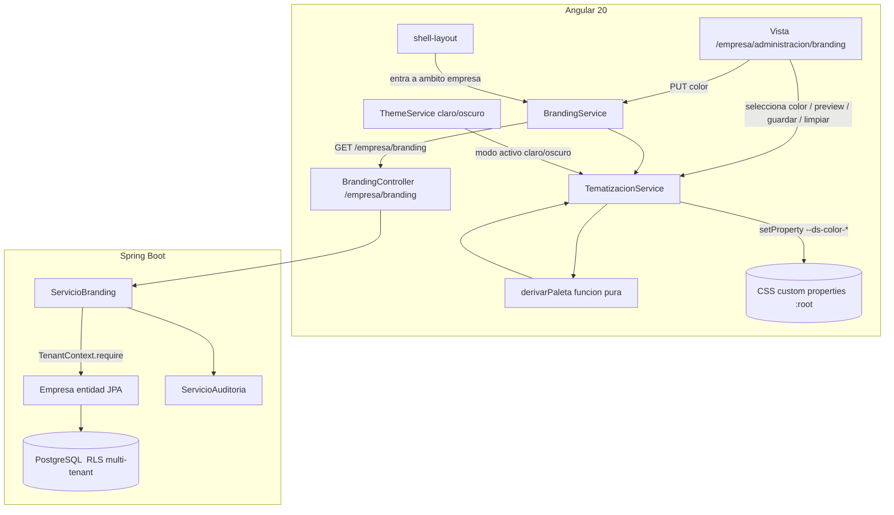

# Design Document

## Overview

Esta funcionalidad añade **tematización por empresa** y un **rediseño visual enterprise global** al CRM multi-tenant Dess-TI, reutilizando el Sistema de Diseño ya maduro (CSS custom properties en `frontend/src/styles/_tokens.scss`) sin reescribirlo.

El corazón técnico es una función pura de derivación de paleta: a partir de un único **Color_Primario_Marca** (`#RRGGBB`) se calcula, de forma determinista, una **Paleta_Derivada** coherente (primario, hover, container, texto-sobre-primario, anillo de foco, superficies de acento) para modo claro y oscuro, **garantizando contraste WCAG 2.1 AA**. Un servicio Angular (`TematizacionService`) aplica esa paleta en runtime sobrescribiendo los `--ds-color-*` en el elemento raíz, y la limpia restaurando el Tema_Corporativo. El color se persiste por tenant en el backend (migración `V67`, DTO extendido, endpoint existente reforzado) con RLS, RBAC deny-by-default y auditoría central.

El rediseño enterprise es aditivo: refina tokens sin romper AA, añade acento de marca al `PageHeader`, introduce un patrón reutilizable de chip de estado con color semántico, pule tarjetas y aplica todo a las cuatro vistas de detalle de Operación (OF, Levantamiento, Permiso, OTI) y sus listas.

### Decisiones de diseño y justificación

- **Un solo color primario, la app deriva el resto.** Reduce la superficie de error del admin y evita combinaciones inaccesibles. La coherencia y el contraste se garantizan por algoritmo, no por criterio del usuario.
- **Derivación pura y determinista.** Permite property-based testing del contraste y la idempotencia sin efectos de I/O. El servicio Angular queda como una capa fina de aplicación de tokens.
- **Reutilizar tokens existentes.** El shell ya conmuta claro/oscuro con `data-theme`; sobrescribir `--ds-color-*` en `:root` inline gana a cualquier valor de hoja de estilo, así que la tematización no requiere recompilar SCSS.
- **Tenant siempre desde el contexto.** El color se resuelve por `TenantContext.require()`, nunca desde la petición; así el aislamiento multi-tenant se apoya en la infraestructura existente (RLS + filtro global de Hibernate) y en el patrón ya usado por `ServicioBranding`.
- **Extender, no duplicar.** Se amplían `BrandingDto`, `ActualizarBrandingCommand`, `ActualizarBrandingRequest`, `Empresa` y `ServicioBranding` en lugar de crear un dominio nuevo, preservando nombre visible y logotipo.

## Architecture



### Flujo de aplicación del color

1. Al entrar al Ambito_Empresa, `shell-layout` dispara `BrandingService.consultar()` → `GET /empresa/branding`.
2. La respuesta incluye ahora `colorPrimario` (nullable). Si existe, `TematizacionService.aplicar(color, modo)` deriva y escribe los tokens; si es nulo o la carga falla, se conserva el Tema_Corporativo.
3. En la vista de branding, cambiar el selector/preset llama a `TematizacionService.previsualizar(color, modo)` (aplicación en vivo). Guardar hace `PUT /empresa/branding`; limpiar hace `PUT` con `colorPrimario` nulo y `TematizacionService.limpiar()`.
4. Conmutar claro/oscuro (`ThemeService`) reevalúa el modo y `TematizacionService` reaplica la variante correspondiente con el color vigente.

## Components and Interfaces

### Frontend

**`TematizacionService` (nuevo)** — `frontend/src/app/core/services/tematizacion.service.ts`
- `aplicar(colorPrimario: string, modo: 'light' | 'dark'): void` — deriva y escribe los `--ds-color-*` en `document.documentElement.style`.
- `previsualizar(colorPrimario: string, modo: 'light' | 'dark'): void` — igual que `aplicar`, usado en vivo antes de guardar.
- `limpiar(): void` — elimina las sobrescrituras inline (`removeProperty`) para volver al Tema_Corporativo.
- `colorActivo(): string | null` — color actualmente aplicado (para reaplicar al cambiar de modo).
- Depende de `ThemeService` para conocer el modo activo y suscribirse a sus cambios.

**`derivarPaleta` (nuevo, función pura)** — `frontend/src/app/core/theming/derivar-paleta.ts`
- Firma: `derivarPaleta(colorPrimario: string, modo: 'light' | 'dark'): PaletaDerivada`.
- Utilidades puras acompañantes: `esHexValido(valor: string): boolean`, `relacionContraste(a: string, b: string): number`, `mezclar(a: string, b: string, t: number): string`, `luminanciaRelativa(color: string): number`.
- Sin acceso al DOM: solo transforma cadenas hex.

**`ChipEstado` (nuevo patrón/componente compartido)** — `frontend/src/app/shared/components/chip-estado/`
- Entrada: `variante: 'exito' | 'advertencia' | 'error' | 'info' | 'neutro'` y `etiqueta: string`.
- Mapea la variante al Token_CSS semántico (`--ds-color-success/warning/error/info`) o a neutro.

**`BrandingService` (extensión)** — `frontend/src/app/features/empresa/services/branding.service.ts`
- `consultar()` devuelve ahora `Branding` con `colorPrimario: string | null`.
- Nuevos: `actualizar(payload)` y ruta de limpieza (`colorPrimario: null`), vía `PUT /empresa/branding`.

**`Branding` (modelo TS, extensión)** — `frontend/src/app/features/empresa/home/home.models.ts`
- `{ nombreVisible: string | null; logo: string | null; colorPrimario: string | null }`.

**`PageHeader` / `StateContainer` / `DataTable` / tarjetas** — refinamiento de estilos usando tokens; `PageHeader` gana un acento basado en `--ds-color-primary`.

### Backend

**`Empresa` (entidad, extensión)** — nuevo campo `brandingColorPrimario: String` (nullable) con getter y ampliación del mutador `actualizarBranding(...)` para aceptar el color.

**`BrandingDto` (extensión)** — `record BrandingDto(String nombreVisible, String logo, String colorPrimario)`; `de(Empresa)` proyecta el nuevo campo.

**`ActualizarBrandingCommand` (extensión)** — `record (String nombreVisible, String logo, String colorPrimario)`.

**`ActualizarBrandingRequest` (extensión, REST)** — añade `@Pattern(regexp = "^#[0-9a-fA-F]{6}$") String colorPrimario` (nullable/blanco permitido = limpiar).

**`ServicioBranding` (extensión)** — `actualizarBranding` persiste y audita también el cambio de color (resumen legible en `detalle`, JSONB en `null,null`, mismo patrón vigente). Valida formato hex antes de persistir (defensa en profundidad además de la validación REST).

**`BrandingController`** — sin cambios de ruta ni de permisos; sigue `GET`/`PUT /empresa/branding` con `branding:leer`/`branding:actualizar`.

**Migración `V67`** — `V67__empresa_branding_color_primario.sql`: `ALTER TABLE ... ADD COLUMN branding_color_primario VARCHAR(7)` con `CHECK` de formato hex y default nulo. Sin cambios de RLS (la Empresa es el tenant y se carga por id).

## Data Models

### Backend (persistencia)

```
Empresa (tabla existente)
  ...
  branding_nombre_visible  TEXT      (existente)
  branding_logo            TEXT      (existente)
  branding_color_primario  VARCHAR(7) NULL   (NUEVO, V67; CHECK formato #RRGGBB o NULL)
```

### DTOs / contratos

```
BrandingDto            { nombreVisible: string|null, logo: string|null, colorPrimario: string|null }
ActualizarBrandingCommand  { nombreVisible: string|null, logo: string|null, colorPrimario: string|null }
ActualizarBrandingRequest  { nombreVisible: @Size(200), logo: @Size(1MB), colorPrimario: @Pattern(#RRGGBB) }
```

### Frontend

```
Branding        { nombreVisible: string|null, logo: string|null, colorPrimario: string|null }

PaletaDerivada  {
  primary: string
  primaryHover: string
  primaryContainer: string
  textOnPrimary: string          // '#ffffff' o '#000000' según AA
  textOnContainer: string
  focusRing: string
  accentSurface: string
  textOnAccentSurface: string
}
```

### Algoritmo de derivación (Derivador_Paleta)

Entrada: `colorPrimario` (`#RRGGBB`) y `modo` (`light`|`dark`). Pasos:

1. **Validar** formato con `esHexValido`; si es inválido, la capa llamante no invoca la derivación (ver Error Handling).
2. **`primary`** = el color de entrada.
3. **`textOnPrimary`** = de `#ffffff` y `#000000`, elegir el que dé mayor `relacionContraste` con `primary`; debe alcanzar ≥ 4.5:1. Como todo color se compara contra blanco y negro (extremos de luminancia), el mejor de los dos siempre logra ≥ 4.5:1 salvo colores de luminancia intermedia estrecha; en ese caso se aplica el paso 6.
4. **`primaryHover`** = `mezclar(primary, '#000000', 0.12)` en modo claro; `mezclar(primary, '#ffffff', 0.12)` en modo oscuro (aclara al pasar el cursor en oscuro).
5. **`primaryContainer`** = mezcla suave hacia la superficie del modo (`mezclar(primary, superficieBase, 0.85)` en claro; hacia superficie oscura en oscuro). **`textOnContainer`** = negro o blanco por contraste AA sobre el container.
6. **Ajuste de contraste de respaldo:** si `textOnPrimary` no alcanza 4.5:1 con ninguno de blanco/negro (color de luminancia intermedia), oscurecer/aclarar `primary` (según modo) mediante `mezclar` en pasos hasta que el mejor de blanco/negro alcance AA; el `primary` mostrado se ajusta a ese valor accesible.
7. **`focusRing`** = `primary` ajustado para ≥ 3:1 contra la superficie del modo (aclarar en oscuro, oscurecer en claro si hace falta).
8. **`accentSurface`** = variante muy tenue del primario apta como fondo de acento; **`textOnAccentSurface`** = color de texto del modo que cumpla AA sobre esa superficie.

`relacionContraste` y `luminanciaRelativa` implementan la fórmula WCAG 2.1 (linealización sRGB + `(L1+0.05)/(L2+0.05)`). Todo es puro y determinista: misma entrada → misma salida.

## Correctness Properties

*A property is a characteristic or behavior that should hold true across all valid executions of a system — essentially, a formal statement about what the system should do. Properties serve as the bridge between human-readable specifications and machine-verifiable correctness guarantees.*

Estas propiedades se derivan de la prework anterior tras consolidar redundancias. La derivación de paleta y la validación son funciones puras, ideales para property-based testing; el aislamiento multi-tenant se valida como propiedad a nivel de servicio con dos tenants.

### Property 1: Contraste AA del texto sobre el primario

*For any* Color_Primario_Marca válido (`#RRGGBB`) y para cada modo (claro y oscuro), la relación de contraste entre `textOnPrimary` y `primary` de la Paleta_Derivada SHALL ser mayor o igual a 4.5:1.

**Validates: Requirements 2.2, 8.1**

### Property 2: Contraste AA de todos los pares texto/superficie derivados

*For any* Color_Primario_Marca válido y para cada modo (claro y oscuro), todos los pares texto/superficie de la Paleta_Derivada SHALL cumplir su umbral AA: `textOnContainer`/`primaryContainer` ≥ 4.5:1, `textOnAccentSurface`/`accentSurface` ≥ 4.5:1, y `focusRing`/superficie del modo ≥ 3:1.

**Validates: Requirements 2.4, 2.5, 8.2, 8.4**

### Property 3: Completitud estructural de la paleta

*For any* Color_Primario_Marca válido, la Paleta_Derivada SHALL contener todos los campos requeridos (`primary`, `primaryHover`, `primaryContainer`, `textOnPrimary`, `textOnContainer`, `focusRing`, `accentSurface`, `textOnAccentSurface`), cada uno con formato hexadecimal válido.

**Validates: Requirements 2.1**

### Property 4: Determinismo de la derivación

*For any* Color_Primario_Marca válido y modo, invocar `derivarPaleta` de forma repetida SHALL producir Paletas_Derivadas idénticas.

**Validates: Requirements 2.3, 2.6**

### Property 5: Aplicación de tokens (round-trip paleta → CSS)

*For any* Color_Primario_Marca válido, tras `aplicar`, la lectura de cada Token_CSS correspondiente en el elemento raíz SHALL devolver exactamente el valor de la Paleta_Derivada escrito para ese token.

**Validates: Requirements 3.1**

### Property 6: Idempotencia de aplicar/limpiar (restauración exacta)

*For any* Color_Primario_Marca válido, aplicar la tematización y luego limpiarla SHALL restaurar exactamente el Tema_Corporativo: no quedan sobrescrituras inline de `--ds-color-*` y los Token_CSS no relacionados con color (tipografía, espaciado, radios, sombras, animación) permanecen sin cambios.

**Validates: Requirements 1.7, 3.5, 9.3**

### Property 7: Aislamiento multi-tenant del color

*For any* par de tenants distintos con colores distintos, el color resuelto y aplicado bajo el contexto de un tenant SHALL ser siempre el de ese tenant y nunca el de otro; el color se resuelve por `TenantContext`, no por datos de la petición.

**Validates: Requirements 4.5, 5.2, 6.6**

### Property 8: Validación de formato hexadecimal

*For any* cadena de entrada, el validador (`esHexValido` en frontend y `@Pattern` en backend) SHALL aceptarla si y solo si coincide con `^#[0-9a-fA-F]{6}$`; una entrada rechazada no modifica el Color_Primario_Marca vigente.

**Validates: Requirements 1.4, 6.4**

### Property 9: Mapeo semántico del Chip_Estado

*For any* variante del conjunto {éxito, advertencia, error, información, neutro}, el Chip_Estado renderizado SHALL usar el Token_CSS semántico correspondiente a esa variante.

**Validates: Requirements 7.3, 7.4**

### Property 10: Contraste AA de los tokens corporativos refinados

*For any* par texto/superficie corporativo enumerado (en modo claro y oscuro), tras el refinamiento de tokens la relación de contraste SHALL cumplir su umbral AA (≥ 4.5:1 texto normal, ≥ 3:1 componentes de interfaz).

**Validates: Requirements 7.6**

## Error Handling

- **Color inválido en el frontend:** la vista de branding valida con `esHexValido` antes de previsualizar o guardar. Si es inválido, muestra un mensaje es-MX, no invoca `derivarPaleta` ni `aplicar`, y conserva el color vigente (Req 1.4).
- **Color inválido en el backend:** `ActualizarBrandingRequest` usa `@Pattern(^#[0-9a-fA-F]{6}$)`; una violación produce HTTP 422 por el manejador de validación existente. `ServicioBranding` revalida como defensa en profundidad antes de persistir (Req 6.4).
- **Limpieza de color:** enviar `colorPrimario` nulo/blanco limpia la columna (mismo patrón "null/blanco limpia" ya usado para nombre/logo) y el frontend llama a `limpiar()` (Req 1.7, 3.5).
- **Fallo de carga del branding:** si `GET /empresa/branding` falla, el frontend registra el error, mantiene el Tema_Corporativo y la aplicación sigue operando; no se lanza excepción no controlada (Req 4.4).
- **Ámbito de plataforma:** en el ámbito super_admin no se resuelve ni aplica color de empresa; se conserva el Tema_Corporativo (Req 5.1).
- **Color de luminancia intermedia:** si ni blanco ni negro alcanzan AA sobre el primario, el Derivador_Paleta ajusta el `primary` mostrado (paso 6 del algoritmo) hasta garantizar `textOnPrimary` accesible (Req 2.2, 8.1).
- **Tenant ausente:** `TenantContext.require()` falla de forma controlada si no hay tenant, como en el resto del dominio; el color nunca se deriva de la petición (Req 6.6).

## Testing Strategy

Se combina testing basado en propiedades (para la lógica pura y el aislamiento) con pruebas por ejemplo/integración (para UI, wiring, contratos e infraestructura).

### Property-Based Testing (aplica a lógica pura y aislamiento)

- **Frontend:** biblioteca **fast-check** con Jasmine/Karma (stack Angular existente). No implementar PBT desde cero.
- **Backend:** **jqwik** (ya presente en el proyecto — existe `.jqwik-database`) con JUnit 5.
- Cada test de propiedad ejecuta un **mínimo de 100 iteraciones**.
- Cada test se etiqueta con un comentario referenciando su propiedad de diseño con el formato: **Feature: tematizacion-empresa-enterprise, Property {número}: {texto}**.
- Cada propiedad de corrección se implementa con **un único** test basado en propiedades.
- Generadores: hex válidos `#RRGGBB` (fast-check `hexaString`/mapeo), cadenas arbitrarias para la validación (P8), y para P7 dos tenants con colores distintos vía contexto simulado.

Mapa propiedad → ubicación:
- P1, P2, P3, P4, P8 (frontend hex), P5, P6 → `derivar-paleta.spec.ts` y `tematizacion.service.spec.ts` (fast-check).
- P7 → prueba de servicio backend `ServicioBrandingTest` (jqwik, dos tenants por `TenantContext`).
- P8 (backend) → validación de `ActualizarBrandingRequest` (jqwik).
- P9 → `chip-estado.component.spec.ts` (fast-check sobre el conjunto de variantes).
- P10 → prueba de contraste sobre pares corporativos enumerados (fast-check sobre el conjunto).

### Unit / Example / Edge Tests

- Vista de branding: presencia de selector + presets según permiso (1.1), selección de preset/entrada libre (1.2, 1.3), mensaje de validación (1.4), previsualización aplica tokens (1.5), preservar nombre/logo (6.7, 9.2).
- `TematizacionService`: aplicar en modo claro/oscuro (3.2, 3.3), conmutar modo reaplica (3.4), color nulo/carga fallida mantienen tema (4.3, 4.4), plataforma sin color (5.1), sin color = defaults (9.1).
- `PageHeader` acento (7.2), Chip_Estado en las 4 Vistas_Operacion y listas (7.5), `prefers-reduced-motion` (8.3).
- Accesibilidad: helper de axe existente `frontend/src/testing/axe` (`esperarSinViolaciones`) en las vistas tocadas; ejecutar specs **one-shot** (`--include`), nunca la suite completa (flakiness de axe).

### Integration Tests

- Backend: `GET`/`PUT /empresa/branding` con color (6.2, 6.3), 403 sin permiso (1.8), auditoría invocada (6.5), tenant desde contexto no desde cuerpo (6.6).
- Carga en `shell-layout` al entrar al ámbito empresa (4.1, 4.2).
- No regresión de shell/navegación (9.4).

### Smoke / Schema Tests

- Migración `V67`: columna `branding_color_primario` existe, nullable, default nulo, con `CHECK` de formato (6.1).
- Constraint arquitectónica: componentes consumen `var(--ds-*)` sin reescribir tokens (7.1) — revisión/lint.

### Verificación del proyecto (comandos)

- Backend: `mvn -o compile`, `mvn -o test-compile`, `mvn -o surefire:test -Dtest=<Clase>` (JAVA_HOME `C:\Program Files\Microsoft\jdk-21.0.12.101-hotspot`, Maven `C:\apache-maven-3.9.10\bin\mvn.cmd`).
- Frontend: `npx ng build --configuration production`; specs one-shot `npx ng test --watch=false --include=<spec>`.
- Los sub-agentes de test hacen **compile-only** (evitar timeouts); el orquestador ejecuta las pruebas.
